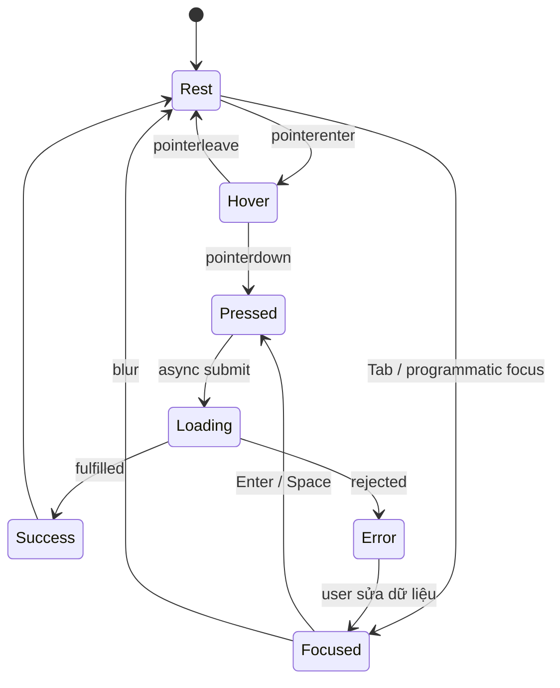
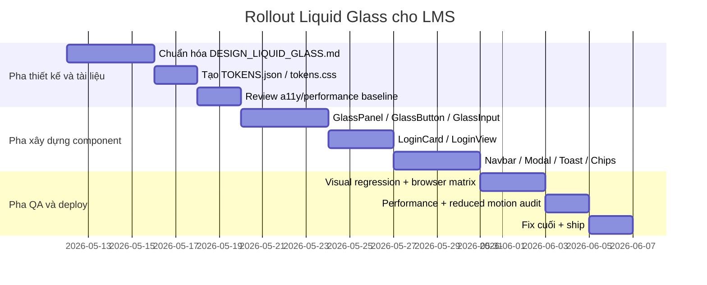

# DESIGN_LIQUID_GLASS.md cho LMS

## Tóm tắt điều hành

“Liquid glass” trên web nên được hiểu là một họ phong cách giao diện dùng bề mặt bán trong suốt, lớp làm mờ nền, viền sáng mảnh, đổ bóng nhẹ và chuyển động mềm để tạo cảm giác chiều sâu mà vẫn giữ được ngữ cảnh của nội dung phía sau. Trên phương diện thuật ngữ, Apple hiện gọi lớp vật liệu động mới của họ là **Liquid Glass**, nhấn mạnh tính quang học của kính và cảm giác “fluidity”; Microsoft mô tả biến thể tương đương là **Acrylic**, một vật liệu bán trong suốt tái tạo hiệu ứng kính mờ; còn trên web, primitive cốt lõi là `backdrop-filter`, vốn chỉ hoạt động khi phần tử có nền trong suốt hoặc bán trong suốt. Nói cách khác, “liquid glass”, “glassmorphism”, “frosted glass” và “translucent UI” là các tên gọi gần nhau về mặt ngôn ngữ thiết kế, nhưng **không có một chuẩn token duy nhất áp dụng chung cho mọi nền tảng**; vì vậy tài liệu này định nghĩa một bộ chuẩn nội bộ cho LMS, dựa trên tài liệu chính thức của Apple, Microsoft, MDN, W3C và web.dev. citeturn7search0turn7search1turn7search2turn9search5turn2view6turn2view4

Đối với LMS, liquid glass phù hợp nhất cho **login card, navbar, top app bar, dropdown, modal, flyout, toast, filter chip, summary card và các lớp phủ ngắn hạn**, nơi cần vừa giữ bối cảnh học tập phía sau vừa ưu tiên điều hướng hoặc phản hồi trạng thái. Ưu điểm chính là tạo chiều sâu, phân tách lớp chức năng khỏi lớp nội dung, và cho cảm giác sản phẩm hiện đại cao cấp; nhược điểm là tốn chi phí render hơn bề mặt đặc, dễ giảm độ tương phản nếu dùng quá mức trên nội dung dày đặc, và có thể gây khó chịu nếu lạm dụng animation/transparency. Vì vậy, tiêu chuẩn này buộc phải kiểm soát chặt **contrast**, **focus**, **reduced motion**, **fallback khi `backdrop-filter` không được hỗ trợ**, và giới hạn số lớp blur sống trên mỗi viewport. citeturn7search1turn7search4turn9search1turn9search5turn2view4turn2view7turn2view8turn2view5

## Nền tảng thiết kế

### Định nghĩa làm việc và phạm vi dùng trong LMS

| Khái niệm | Định nghĩa dùng trong tài liệu này | Nên dùng trong LMS | Không nên dùng |
|---|---|---|---|
| Liquid Glass | Phong cách vật liệu động, có độ trong suốt, blur nền, chuyển động mềm và cảm giác “kính lỏng” | Điều hướng, controls nổi, modal, login card, CTA nổi bật | Toàn bộ vùng nội dung dài, bảng dữ liệu dày đặc |
| Glassmorphism | Cách triển khai web phổ biến của liquid glass: bề mặt bán trong suốt + blur + border highlight | Cards, widgets, auth screens, summary surfaces | Text-heavy pages, lesson article dài |
| Frosted glass | Hiệu ứng “kính mờ” tập trung vào blur nền phía sau | Overlay, dialog, nav, flyout | Cell-level table, dense form grid |
| Translucent UI | Thuật ngữ rộng cho lớp phủ xuyên sáng giữ bối cảnh nền | Sticky headers, sidepanels, sheets | Nền chính của mọi section |

Apple mô tả Liquid Glass như một vật liệu động dùng cho **controls và navigation**, giúp giữ nội dung nền ở trung tâm thay vì bị che khuất; Microsoft mô tả Acrylic là vật liệu tái tạo kính mờ và khuyến nghị dùng chủ yếu cho **transient surfaces** như flyout, context menu, light-dismiss panes; trên web, `backdrop-filter` được thiết kế chính xác để tạo kiểu nền kiểu hệ điều hành, như frosted-glass, overlay và translucent navigation headers. Từ ba nguồn này, quy tắc áp dụng cho LMS là: **glass là lớp chức năng, không phải lớp nội dung chính**. citeturn7search1turn7search2turn9search5turn9search1turn2view4

### Nguyên tắc áp dụng bắt buộc

| Quy tắc | Quy định |
|---|---|
| Glass phải có ý nghĩa lớp | Chỉ dùng khi cần tách lớp điều hướng/điều khiển khỏi nội dung phía sau |
| Glass không phải nền mặc định | Màn lesson dài, bảng điểm, bảng dữ liệu, editor dài dùng surface bán đặc hoặc solid |
| Các lớp glass mạnh chỉ dùng cho surface nổi bật | Login card, modal, flyout, toast, dropdown |
| Tránh chồng nhiều lớp glass | Không đặt modal glass trên nền card glass mạnh trên nền drawer glass mạnh |
| Ưu tiên semantic material | Chọn mức glass theo chức năng, không theo “màu trông đẹp” |
| Muốn brand hóa thì tint nhẹ | Color tint chỉ nhấn CTA, chip trạng thái hoặc accent blob, không nhuộm mọi surface |
| Bảo toàn readability | Nếu không bảo đảm contrast ở trạng thái nền xấu nhất, tăng opacity hoặc chuyển sang surface solid |

Apple khuyến nghị chọn material theo **ngữ nghĩa sử dụng**, không theo màu sắc bề ngoài; Apple cũng lưu ý Liquid Glass không có màu nội tại mà lấy màu từ nội dung phía sau, và chỉ một số control nên được áp màu kiểu “stained glass”; Microsoft khuyến nghị tránh xếp nhiều lớp Acrylic vì có thể tạo ảo giác quang học gây nhiễu. Vì vậy, đặc tả này cố ý đặt phần lớn bề mặt glass của LMS ở mức **semi-opaque** và giữ **primary button** gần như opaque để không hy sinh readability. citeturn1search4turn7search8turn9search5

### Trạng thái không xác định và cách xử lý

| Hạng mục | Trạng thái | Quy ước xử lý |
|---|---|---|
| Font thương hiệu chính thức | không xác định | Dùng `Inter` + `system-ui` làm chuẩn tạm |
| Mức hỗ trợ trình duyệt tối thiểu của sản phẩm | không xác định | Hỗ trợ đầy đủ trên stable browsers hiện hành; legacy browsers dùng fallback không blur |
| Có cần dark mode ở tất cả màn hình hay không | không xác định | Mặc định hỗ trợ light/dark đầy đủ cho auth + dashboard + shell |
| Dùng Tailwind v3 hay v4 | không xác định | Nếu có `tailwind.config.js`, dùng snippet v3; nếu đã lên v4, dùng `@theme` và CSS variables |
| Dùng TypeScript hay JavaScript ở frontend | không xác định | Snippet Vue dùng cú pháp tương thích; agent đổi đuôi `.ts/.js` theo repo |

## Hệ token thị giác

### Bảng màu và độ trong suốt chuẩn nội bộ

Các bảng dưới đây là **bộ token nội bộ đề xuất** cho LMS. Chúng được tổng hợp từ nguyên tắc translucency/materials của Apple, nguyên tắc Acrylic của Microsoft, hỗ trợ kỹ thuật của `backdrop-filter` trên web, cùng yêu cầu contrast của W3C; đây là **source of truth nội bộ**, không phải một tiêu chuẩn ngành duy nhất. citeturn7search0turn7search2turn7search8turn9search5turn2view6turn2view7turn2view8

#### Bảng màu light mode

| Token | Hex base | RGBA / effective | Mục đích |
|---|---|---:|---|
| `--lg-primary` | `#2563EB` | `rgba(37,99,235,1)` | CTA chính, focus ring light, link mạnh |
| `--lg-secondary` | `#0F766E` | `rgba(15,118,110,1)` | CTA phụ, trạng thái thành công mềm |
| `--lg-accent` | `#7C3AED` | `rgba(124,58,237,1)` | Accent học thuật, charts, highlights |
| `--lg-bg-start` | `#EFF6FF` | `rgba(239,246,255,1)` | Nền gradient đầu |
| `--lg-bg-mid` | `#F8FAFC` | `rgba(248,250,252,1)` | Nền trung tính chính |
| `--lg-bg-end` | `#F5F3FF` | `rgba(245,243,255,1)` | Nền gradient cuối |
| `--lg-surface-glass` | `#FFFFFF` | `rgba(255,255,255,0.56)` | Card glass thường |
| `--lg-surface-glass-strong` | `#FFFFFF` | `rgba(255,255,255,0.72)` | Login card, modal, dropdown |
| `--lg-surface-solid-soft` | `#FFFFFF` | `rgba(255,255,255,0.88)` | Dense form/table fallback |
| `--lg-border-glass` | `#FFFFFF` | `rgba(255,255,255,0.42)` | Viền highlight ngoài |
| `--lg-border-contrast` | `#94A3B8` | `rgba(148,163,184,0.28)` | Separator trên surface sáng |
| `--lg-overlay-scrim` | `#0F172A` | `rgba(15,23,42,0.18)` | Scrim nhẹ cho modal/backdrop |
| `--lg-text` | `#0F172A` | `rgba(15,23,42,1)` | Text chính |
| `--lg-text-muted` | `#475569` | `rgba(71,85,105,1)` | Text phụ |
| `--lg-text-subtle` | `#64748B` | `rgba(100,116,139,1)` | Placeholder, meta text |
| `--lg-success` | `#16A34A` | `rgba(22,163,74,1)` | Success |
| `--lg-warning` | `#D97706` | `rgba(217,119,6,1)` | Warning |
| `--lg-danger` | `#DC2626` | `rgba(220,38,38,1)` | Error/destructive |

#### Bảng màu dark mode

| Token | Hex base | RGBA / effective | Mục đích |
|---|---|---:|---|
| `--lg-primary` | `#2563EB` | `rgba(37,99,235,1)` | Giữ brand/action nhất quán giữa hai mode |
| `--lg-secondary` | `#0F766E` | `rgba(15,118,110,1)` | CTA phụ/semantic |
| `--lg-accent` | `#7C3AED` | `rgba(124,58,237,1)` | Accent |
| `--lg-bg-start` | `#020617` | `rgba(2,6,23,1)` | Nền gradient đầu |
| `--lg-bg-mid` | `#0F172A` | `rgba(15,23,42,1)` | Nền chính |
| `--lg-bg-end` | `#1E293B` | `rgba(30,41,59,1)` | Nền gradient cuối |
| `--lg-surface-glass` | `#0F172A` | `rgba(15,23,42,0.52)` | Card glass thường |
| `--lg-surface-glass-strong` | `#0F172A` | `rgba(15,23,42,0.68)` | Login card, modal, dropdown |
| `--lg-surface-solid-soft` | `#0F172A` | `rgba(15,23,42,0.82)` | Dense form/table fallback |
| `--lg-border-glass` | `#FFFFFF` | `rgba(255,255,255,0.14)` | Viền ngoài light-on-dark |
| `--lg-border-contrast` | `#94A3B8` | `rgba(148,163,184,0.24)` | Separator dark |
| `--lg-overlay-scrim` | `#020617` | `rgba(2,6,23,0.56)` | Scrim modal/backdrop |
| `--lg-text` | `#F8FAFC` | `rgba(248,250,252,1)` | Text chính |
| `--lg-text-muted` | `#CBD5E1` | `rgba(203,213,225,1)` | Text phụ rõ |
| `--lg-text-subtle` | `#94A3B8` | `rgba(148,163,184,1)` | Placeholder/meta text |
| `--lg-success` | `#22C55E` | `rgba(34,197,94,1)` | Success |
| `--lg-warning` | `#F59E0B` | `rgba(245,158,11,1)` | Warning |
| `--lg-danger` | `#F87171` | `rgba(248,113,113,1)` | Error/destructive |

**Contrast tối thiểu để khóa token.** Với bộ token đề xuất này, `#2563EB` trên nền chữ trắng đạt mức contrast vượt AA cho text thường, `#0F172A` trên nền sáng và `#F8FAFC` trên nền tối đều ở mức rất an toàn; vì nền glass là bán trong suốt và thay đổi theo nội dung phía sau, agent phải kiểm thử contrast trên **worst-case background**, không chỉ trên bản mock phẳng. Về chuẩn chính thức, WCAG yêu cầu text thường đạt ít nhất **4.5:1**, text lớn ít nhất **3:1**, còn non-text UI indicators và trạng thái điều khiển ít nhất **3:1**. citeturn2view7turn2view8

### Mức opacity và gradient khuyến nghị

| Token | Giá trị | Dùng cho |
|---|---|---|
| `--lg-opacity-chip` | `0.28` | Badge/chip nhỏ |
| `--lg-opacity-nav` | `0.40` | Sticky navbar nhẹ |
| `--lg-opacity-card` | `0.56` | Card glass mặc định |
| `--lg-opacity-dialog` | `0.72` | Login card, modal, drawer nổi |
| `--lg-opacity-fallback` | `0.88` | Khi không có blur hoặc khi dense content |

| Gradient | CSS khuyến nghị | Dùng cho |
|---|---|---|
| Light page background | `linear-gradient(135deg, #EFF6FF 0%, #F8FAFC 42%, #F5F3FF 100%)` | Trang login, shell nền sáng |
| Dark page background | `linear-gradient(135deg, #020617 0%, #0F172A 42%, #1E293B 100%)` | Dark shell/auth |
| Light accent blob | `linear-gradient(135deg, rgba(37,99,235,.22) 0%, rgba(14,165,233,.16) 35%, rgba(124,58,237,.18) 100%)` | Blob trang trí |
| Dark accent blob | `linear-gradient(135deg, rgba(37,99,235,.34) 0%, rgba(15,118,110,.24) 40%, rgba(124,58,237,.30) 100%)` | Blob dark mode |
| Modal scrim | `linear-gradient(180deg, rgba(2,6,23,.22), rgba(2,6,23,.40))` | Backdrop modal |

### Elevation, blur, đổ bóng và phân lớp

`backdrop-filter` áp dụng hiệu ứng vào **nội dung phía sau phần tử**, đòi hỏi phần tử phủ phía trên phải trong suốt hoặc bán trong suốt; khi được áp dụng, nó tạo ra **stacking context mới**. Apple xem Liquid Glass là lớp chức năng riêng cho controls/navigation; Microsoft cảnh báo không nên chồng nhiều lớp acrylic; web.dev cảnh báo `backdrop-filter` có thể ảnh hưởng đến hiệu năng và nên có fallback rõ ràng. Từ đó, LMS nên giới hạn blur theo vai trò của surface, và z-index phải được quy hoạch từ đầu. citeturn2view6turn2view4turn7search1turn9search5

#### Blur scale

| Token | Giá trị | Tailwind gần nhất | Dùng cho |
|---|---:|---|---|
| `--lg-blur-none` | `0px` | `backdrop-blur-none` | Surface đặc |
| `--lg-blur-subtle` | `8px` | `backdrop-blur-sm` | Navbar, chip lớn |
| `--lg-blur-soft` | `12px` | `backdrop-blur-md` | Card nhỏ, floating actions |
| `--lg-blur-card` | `16px` | `backdrop-blur-lg` | Card mặc định |
| `--lg-blur-dialog` | `24px` | `backdrop-blur-xl` | Login card, modal |
| `--lg-blur-hero` | `40px` | `backdrop-blur-2xl` | Hero/decor lớn, không áp dụng cho nhiều phần tử cùng lúc |
| `--lg-blur-blob` | `64px` | `backdrop-blur-3xl` / `filter: blur(64px)` | Chỉ blob nền, ưu tiên asset prerender nếu lớn |

Tailwind hỗ trợ sẵn thang blur `4/8/12/16/24/40/64px` và cho phép dùng giá trị tùy chỉnh hoặc CSS variables, nên palette blur ở trên bám sát hệ utility của Tailwind để agent không phải “dịch” lại giữa design và code. citeturn2view9

#### Backdrop settings và box-shadow

| Surface | Backdrop filter | Shadow | Border/Highlight |
|---|---|---|---|
| Navbar | `saturate(140%) blur(12px)` | `0 1px 2px rgba(15,23,42,.06), 0 8px 24px rgba(15,23,42,.08)` | `1px` border + top highlight |
| Glass card | `saturate(160%) blur(16px)` | `0 8px 30px rgba(15,23,42,.10), 0 1px 0 rgba(255,255,255,.22) inset` | Border glass chuẩn |
| Login card | `saturate(180%) blur(24px)` | `0 18px 60px rgba(15,23,42,.18), 0 1px 0 rgba(255,255,255,.26) inset` | Border mạnh hơn |
| Modal/dialog | `saturate(180%) blur(24px)` | `0 24px 80px rgba(2,6,23,.32)` | Border mảnh + scrim nền |
| Toast | `saturate(160%) blur(16px)` | `0 12px 36px rgba(15,23,42,.14)` | Border tùy semantic |
| Chip/badge | `saturate(140%) blur(8px)` | `0 2px 8px rgba(15,23,42,.08)` | Border mảnh |

#### Z-index conventions

| Token | Giá trị | Vai trò |
|---|---:|---|
| `--z-base` | `0` | Nội dung trang |
| `--z-decor` | `10` | Blob nền, trang trí |
| `--z-sticky` | `20` | Sticky header/nav |
| `--z-drawer` | `30` | Side drawer/panel |
| `--z-dropdown` | `40` | Menu/flyout |
| `--z-overlay` | `50` | Backdrop modal |
| `--z-modal` | `60` | Dialog/modal |
| `--z-toast` | `70` | Toast/message stack |
| `--z-tooltip` | `80` | Tooltip |
| `--z-debug` | `90` | Dev/debug overlays |

### Radius, spacing và kích thước thành phần

| Radius token | px | rem | Dùng cho |
|---|---:|---:|---|
| `--lg-radius-xs` | `4` | `0.25rem` | Badge nhỏ |
| `--lg-radius-sm` | `8` | `0.5rem` | Input compact |
| `--lg-radius-md` | `12` | `0.75rem` | Button/input chuẩn |
| `--lg-radius-lg` | `16` | `1rem` | Card nhỏ |
| `--lg-radius-xl` | `20` | `1.25rem` | Card thường |
| `--lg-radius-2xl` | `24` | `1.5rem` | Login card/modal |
| `--lg-radius-3xl` | `32` | `2rem` | Hero card/surface lớn |
| `--lg-radius-pill` | `9999` | `9999px` | Pill/chip/full round |

| Spacing token | px | rem |
|---|---:|---:|
| `--lg-space-2xs` | `4` | `0.25rem` |
| `--lg-space-xs` | `8` | `0.5rem` |
| `--lg-space-sm` | `12` | `0.75rem` |
| `--lg-space-md` | `16` | `1rem` |
| `--lg-space-lg` | `24` | `1.5rem` |
| `--lg-space-xl` | `32` | `2rem` |
| `--lg-space-2xl` | `40` | `2.5rem` |
| `--lg-space-3xl` | `48` | `3rem` |
| `--lg-space-4xl` | `64` | `4rem` |

| Size token | px | rem | Quy ước |
|---|---:|---:|---|
| `--lg-control-xs` | `32` | `2rem` | Icon button nhỏ |
| `--lg-control-sm` | `36` | `2.25rem` | Compact input/button |
| `--lg-control-md` | `44` | `2.75rem` | Mặc định cho control chính |
| `--lg-control-lg` | `48` | `3rem` | CTA rõ |
| `--lg-control-xl` | `56` | `3.5rem` | Hero CTA |
| `--lg-avatar-sm` | `32` | `2rem` | Avatar nhỏ |
| `--lg-avatar-md` | `40` | `2.5rem` | Avatar vừa |
| `--lg-avatar-lg` | `56` | `3.5rem` | Avatar lớn |

WCAG 2.2 đưa mức tối thiểu cho target size ở **24×24 CSS px**; bộ chuẩn này đặt **44px** làm kích thước điều khiển mặc định để tăng khả năng chạm/bấm, giảm lệch mục tiêu khi dùng touch và bảo đảm cảm giác “premium” của surface kính. citeturn16search0turn16search6turn16search4

### Typography

Không có font “liquid glass” chính thức cho web; phần không xác định ở đây là brand font của dự án. Chuẩn tạm cho LMS là `Inter, ui-sans-serif, system-ui, -apple-system, Segoe UI, Roboto, Helvetica Neue, Arial, sans-serif`. Chữ trên glass phải ưu tiên **độ rõ, nhịp dọc thoáng, weight đủ chắc**, không lạm dụng ultra-light. W3C nhấn mạnh readability phụ thuộc vào contrast giữa luminance của chữ và nền thay vì hue; Apple cũng lưu ý vibrancy/material nên được dùng để hỗ trợ legibility chứ không làm suy yếu nó. citeturn2view7turn7search3

| Style | px | rem | Weight | Line-height | Letter-spacing |
|---|---:|---:|---:|---:|---:|
| `h1` | `40` | `2.5rem` | `800` | `1.10` | `-0.03em` |
| `h2` | `32` | `2rem` | `700` | `1.15` | `-0.025em` |
| `h3` | `28` | `1.75rem` | `700` | `1.20` | `-0.02em` |
| `h4` | `24` | `1.5rem` | `700` | `1.25` | `-0.015em` |
| `h5` | `20` | `1.25rem` | `600` | `1.30` | `-0.01em` |
| `h6` | `18` | `1.125rem` | `600` | `1.35` | `-0.005em` |
| `body-lg` | `18` | `1.125rem` | `400` | `1.65` | `0` |
| `body` | `16` | `1rem` | `400` | `1.60` | `0` |
| `body-sm` | `14` | `0.875rem` | `400` | `1.55` | `0` |
| `label` | `14` | `0.875rem` | `600` | `1.40` | `0.005em` |
| `caption` | `12` | `0.75rem` | `500` | `1.40` | `0.01em` |
| `overline` | `11` | `0.6875rem` | `700` | `1.35` | `0.08em` |

**Quy định dùng chữ trên glass.** Body text không xuống dưới `14px` trên surface bán trong suốt; text dài hơn 3 dòng nên dùng `surface-solid-soft` hoặc tăng opacity lên ít nhất mức dialog; meta text/placeholder không được là phương tiện duy nhất truyền đạt trạng thái. citeturn2view7turn2view8

## Mẫu thành phần và chuyển động

### Lớp nền tái sử dụng

Đây là lớp cơ sở để các thành phần glass dùng chung. Vì `backdrop-filter` là primitive trọng tâm của phong cách này, cần chuẩn hóa utility thay vì để mỗi component tự tùy hứng chọn blur/opacity/shadow. Tailwind hỗ trợ theme customization, dark mode, backdrop blur và utility classes cho hover/focus; khi cần pixel-perfect, có thể dùng arbitrary values hoặc CSS variables. citeturn4search0turn4search1turn2view9turn4search4

```css
/* file: frontend/src/styles/glass.css */
:root {
  color-scheme: light dark;

  --lg-primary: #2563eb;
  --lg-secondary: #0f766e;
  --lg-accent: #7c3aed;

  --lg-bg-start: #eff6ff;
  --lg-bg-mid: #f8fafc;
  --lg-bg-end: #f5f3ff;

  --lg-surface-glass: rgba(255, 255, 255, 0.56);
  --lg-surface-glass-strong: rgba(255, 255, 255, 0.72);
  --lg-surface-solid-soft: rgba(255, 255, 255, 0.88);

  --lg-border-glass: rgba(255, 255, 255, 0.42);
  --lg-border-contrast: rgba(148, 163, 184, 0.28);
  --lg-overlay-scrim: rgba(15, 23, 42, 0.18);

  --lg-text: #0f172a;
  --lg-text-muted: #475569;
  --lg-text-subtle: #64748b;

  --lg-radius-md: 12px;
  --lg-radius-lg: 16px;
  --lg-radius-xl: 20px;
  --lg-radius-2xl: 24px;
  --lg-radius-3xl: 32px;

  --lg-blur-soft: 12px;
  --lg-blur-card: 16px;
  --lg-blur-dialog: 24px;

  --lg-shadow-sm: 0 1px 2px rgba(15, 23, 42, 0.06), 0 6px 20px rgba(15, 23, 42, 0.08);
  --lg-shadow-md: 0 8px 30px rgba(15, 23, 42, 0.10), inset 0 1px 0 rgba(255, 255, 255, 0.22);
  --lg-shadow-lg: 0 18px 60px rgba(15, 23, 42, 0.18), inset 0 1px 0 rgba(255, 255, 255, 0.26);
}

.dark {
  --lg-bg-start: #020617;
  --lg-bg-mid: #0f172a;
  --lg-bg-end: #1e293b;

  --lg-surface-glass: rgba(15, 23, 42, 0.52);
  --lg-surface-glass-strong: rgba(15, 23, 42, 0.68);
  --lg-surface-solid-soft: rgba(15, 23, 42, 0.82);

  --lg-border-glass: rgba(255, 255, 255, 0.14);
  --lg-border-contrast: rgba(148, 163, 184, 0.24);
  --lg-overlay-scrim: rgba(2, 6, 23, 0.56);

  --lg-text: #f8fafc;
  --lg-text-muted: #cbd5e1;
  --lg-text-subtle: #94a3b8;
}

.glass-surface {
  background: var(--lg-surface-glass);
  border: 1px solid var(--lg-border-glass);
  box-shadow: var(--lg-shadow-md);
  backdrop-filter: saturate(160%) blur(var(--lg-blur-card));
  -webkit-backdrop-filter: saturate(160%) blur(var(--lg-blur-card));
}

.glass-surface-strong {
  background: var(--lg-surface-glass-strong);
  border: 1px solid var(--lg-border-glass);
  box-shadow: var(--lg-shadow-lg);
  backdrop-filter: saturate(180%) blur(var(--lg-blur-dialog));
  -webkit-backdrop-filter: saturate(180%) blur(var(--lg-blur-dialog));
}

.glass-solid-soft {
  background: var(--lg-surface-solid-soft);
  border: 1px solid var(--lg-border-contrast);
}

@supports not ((backdrop-filter: blur(1px)) or (-webkit-backdrop-filter: blur(1px))) {
  .glass-surface,
  .glass-surface-strong {
    background: var(--lg-surface-solid-soft);
    backdrop-filter: none;
    -webkit-backdrop-filter: none;
  }
}
```

`color-scheme: light dark` nên được khai báo ở root để native controls và UA chrome biết trang hỗ trợ cả hai mode; `prefers-color-scheme` dùng để chọn light/dark values khi cần; CSS custom properties phù hợp nhất để ánh xạ token thiết kế sang utility hoặc component-level styles. citeturn14view0turn14view1turn14view2

### Cards và login card

**Card thường** nên có độ trong suốt trung bình, blur 16px, radius lớn, border highlight mảnh. **Login card** phải là bề mặt mạnh hơn card thông thường: opacity cao hơn, blur 24px, shadow sâu hơn, nhưng nội dung bên trong phải ưu tiên readability hơn “wow effect”. Với auth screen, surface mạnh là hợp lý vì nó là một khối tác vụ ngắn, nổi bật và có giá trị điều hướng cao. Điều này phù hợp với nguyên tắc dùng glass cho surface chức năng nổi và transient/attention surfaces, thay vì phủ rộng toàn app. citeturn7search1turn9search5

```html
<!-- Card tiêu chuẩn -->
<section
  class="rounded-[32px] border border-white/40 bg-white/55 p-6 shadow-[0_8px_30px_rgba(15,23,42,.10),inset_0_1px_0_rgba(255,255,255,.22)] backdrop-blur-lg dark:border-white/15 dark:bg-slate-950/55"
>
  ...
</section>

<!-- Login card -->
<section
  class="rounded-[32px] border border-white/45 bg-white/72 p-8 shadow-[0_18px_60px_rgba(15,23,42,.18),inset_0_1px_0_rgba(255,255,255,.26)] backdrop-blur-xl dark:border-white/15 dark:bg-slate-950/70"
>
  ...
</section>
```

**A11y note**  
Login card phải giữ text chính trên nền có contrast đo được ở trạng thái xấu nhất. Nếu hero/background phía sau nhiều ảnh hoặc màu sẫm không kiểm soát được, agent phải tăng opacity card lên mức `surface-solid-soft` hoặc thêm scrim phía sau card. citeturn2view7turn2view4

### Navbar và top navigation

Navbar glass chỉ nên dùng blur nhẹ đến vừa, opacity thấp hơn card, và luôn có **border-bottom / separator** mảnh để neo bề mặt vào layout. Sticky nav là use-case rất hợp cho translucent UI vì nó giữ bối cảnh lesson/dashboard phía sau trong khi vẫn phân tách lớp navigation. citeturn7search1turn2view4

```html
<header
  class="sticky top-0 z-20 border-b border-white/30 bg-white/40 backdrop-blur-md dark:border-white/10 dark:bg-slate-950/40"
>
  ...
</header>
```

**A11y note**  
Nav phải giữ tab order hợp lý; nếu có menu button, dùng button thật và trạng thái mở/đóng phù hợp với pattern menu button. Với keyboard, đừng dùng clickable `div` cho avatar menu. citeturn5search2turn17view0

### Buttons

Primary button trong hệ liquid glass **không nên là glass hoàn toàn**. Primary action của LMS cần ổn định thị giác, contrast tốt, và rõ ràng trên nhiều nền — vì vậy variant primary nên gần-opaque; secondary và ghost mới tận dụng glass nhiều hơn.

| Variant | Mục tiêu | Tailwind gợi ý |
|---|---|---|
| Primary | CTA chính, submit, login | `bg-blue-600 text-white hover:bg-blue-700 active:bg-blue-800` |
| Secondary | Hành động phụ nhưng vẫn chắc | `bg-white/60 text-slate-900 border border-white/40 backdrop-blur-md dark:bg-slate-900/60 dark:text-slate-50 dark:border-white/15` |
| Ghost | Inline actions, toolbars | `bg-transparent text-slate-700 hover:bg-white/35 dark:text-slate-200 dark:hover:bg-white/10` |

```html
<button
  class="inline-flex h-11 items-center justify-center rounded-xl bg-blue-600 px-4 text-sm font-semibold text-white shadow-[0_8px_24px_rgba(37,99,235,.28)] transition duration-150 ease-out hover:-translate-y-px hover:bg-blue-700 focus-visible:outline-none focus-visible:ring-2 focus-visible:ring-blue-700 focus-visible:ring-offset-2 focus-visible:ring-offset-white active:translate-y-0 active:scale-[.98] disabled:cursor-not-allowed disabled:opacity-50 dark:focus-visible:ring-blue-300 dark:focus-visible:ring-offset-slate-950"
>
  Đăng nhập
</button>
```

**A11y note**  
Button phải dùng phần tử `<button>`, có label truy cập được, kích hoạt bằng `Enter` và `Space`, và nếu mở dialog thì focus phải chuyển vào dialog; nếu đóng dialog, focus thường quay lại nút đã mở dialog. citeturn17view0turn14view3

### Inputs và form fields

Input glass phù hợp cho auth hoặc biểu mẫu ngắn. Với form dày đặc hoặc biểu mẫu dài, nên chuyển sang `glass-solid-soft` để giảm nhiễu. Placeholder không được là nhãn duy nhất; label phải hiện diện rõ.

```html
<label class="space-y-2">
  <span class="block text-sm font-semibold text-slate-700 dark:text-slate-200">Email</span>
  <input
    class="h-11 w-full rounded-xl border border-white/45 bg-white/62 px-4 text-slate-900 placeholder:text-slate-500 shadow-[inset_0_1px_0_rgba(255,255,255,.22)] backdrop-blur-md outline-none transition duration-150 ease-out focus:border-blue-600 focus:ring-2 focus:ring-blue-700/90 dark:border-white/15 dark:bg-slate-950/62 dark:text-slate-50 dark:placeholder:text-slate-400 dark:focus:border-blue-300 dark:focus:ring-blue-300/90"
    type="email"
    autocomplete="username"
  />
</label>
```

**A11y note**  
- Inline validation lỗi sau tương tác dùng `role="alert"` khi lỗi là thông tin cần chú ý ngay; thông báo trạng thái không khẩn cấp có thể dùng `role="status"` hoặc `aria-live="polite"`.  
- Không đặt button/link bên trong vùng `role="alert"`.  
- Control focus indicator phải đạt contrast **ít nhất 3:1** với vùng kề cận. citeturn15view1turn15view0turn2view8

### Modals

Modal là nơi glass phát huy tốt: scrim mờ + dialog glass mạnh. Tuy nhiên modal phải thật sự cư xử như modal: nền ngoài bị che và không tương tác được, focus bị giới hạn trong dialog, dialog có label rõ.

```html
<div class="fixed inset-0 z-50 bg-slate-950/40 backdrop-blur-sm">
  <div class="mx-auto flex min-h-full max-w-2xl items-center justify-center p-4">
    <section
      role="dialog"
      aria-modal="true"
      aria-labelledby="dialog-title"
      class="w-full rounded-[32px] border border-white/45 bg-white/72 p-8 shadow-[0_24px_80px_rgba(2,6,23,.32)] backdrop-blur-xl dark:border-white/15 dark:bg-slate-950/70"
    >
      <h2 id="dialog-title" class="text-2xl font-bold">Xác nhận nộp bài</h2>
      ...
    </section>
  </div>
</div>
```

**A11y note**  
Theo APG, `aria-modal="true"` chỉ nên dùng khi ứng dụng thực sự ngăn tương tác với nội dung bên ngoài và styling cũng che mờ lớp ngoài; dialog cần `role="dialog"` và có `aria-labelledby` hoặc `aria-label`. Nếu nội dung mô tả dài, không nên luôn gắn `aria-describedby` bừa bãi vì screen reader có thể đọc thành một chuỗi dài khó hiểu. citeturn14view3

### Toasts, badges, chips

Toast là feedback ngắn, nên dùng glass vừa phải và semantic color tinh tế. Badge/chip nên có blur thấp hoặc không blur nếu đặt dày đặc trong table/list.

```html
<!-- Toast info/success -->
<div
  role="status"
  class="rounded-2xl border border-white/35 bg-white/68 px-4 py-3 text-sm text-slate-800 shadow-[0_12px_36px_rgba(15,23,42,.14)] backdrop-blur-lg dark:border-white/15 dark:bg-slate-950/70 dark:text-slate-100"
>
  Đã lưu thay đổi.
</div>

<!-- Toast lỗi khẩn -->
<div
  role="alert"
  class="rounded-2xl border border-red-300/60 bg-red-50/80 px-4 py-3 text-sm text-red-900 shadow-[0_12px_36px_rgba(127,29,29,.18)] backdrop-blur-lg dark:border-red-400/30 dark:bg-red-950/75 dark:text-red-100"
>
  Phiên đăng nhập sắp hết hạn.
</div>

<!-- Chip -->
<span
  class="inline-flex h-8 items-center rounded-full border border-white/35 bg-white/32 px-3 text-xs font-semibold text-slate-700 backdrop-blur-sm dark:border-white/10 dark:bg-white/8 dark:text-slate-200"
>
  Đang học
</span>
```

**A11y note**  
`role="status"` là live region “polite” cho thông tin tư vấn không khẩn cấp; `role="alert"` là assertive, dùng tiết kiệm cho tình huống cần chú ý ngay, như lỗi validation quan trọng hoặc mất kết nối. citeturn15view0turn15view1

### Lists, tables và avatars

Danh sách và bảng là nơi liquid glass dễ bị lạm dụng nhất. Quy định chuẩn:

- Container bảng có thể là glass nhẹ.
- Header, row hover, selected row dùng **semi-opaque hoặc solid-soft**, không dùng ô bảng trong suốt mạnh.
- Dense data như grade table, attendance grid, finance grid không nên cho từng cell có blur riêng.
- Avatar có thể đặt trong vỏ glass nhẹ, nhưng ảnh avatar thật không cần blur.

```html
<div class="overflow-hidden rounded-[24px] border border-white/35 bg-white/55 backdrop-blur-lg dark:border-white/15 dark:bg-slate-950/55">
  <table class="min-w-full border-collapse text-sm">
    <thead class="bg-white/70 dark:bg-slate-950/78">
      ...
    </thead>
    <tbody class="[&_tr]:border-t [&_tr]:border-slate-200/60 dark:[&_tr]:border-white/10">
      ...
    </tbody>
  </table>
</div>
```

**A11y note**  
Bảng vẫn phải ưu tiên semantics HTML gốc (`<table>`, `<thead>`, `<th>`, `<tbody>`). Liquid glass là lớp trình bày, không được phá cấu trúc dữ liệu hoặc làm indicator trạng thái hàng/sort/filter khó nhận ra. Các dấu hiệu sort, selection, hover, focus trong bảng phải đạt contrast **ít nhất 3:1**. citeturn2view8

### Loaders và skeletons

Glass loaders nên dùng animation rất tiết chế. Skeleton shimmer có thể đẹp, nhưng phải tắt hoặc giảm mạnh khi người dùng bật reduced motion.

```html
<div class="rounded-xl bg-white/45 backdrop-blur-sm dark:bg-white/10">
  <div class="h-4 w-32 rounded-full bg-slate-300/70 dark:bg-slate-600/70"></div>
</div>
```

```css
@keyframes glass-pulse {
  0%, 100% { opacity: 0.72; }
  50% { opacity: 1; }
}

.skeleton-glass {
  animation: glass-pulse 1.4s ease-in-out infinite;
}

@media (prefers-reduced-motion: reduce) {
  .skeleton-glass {
    animation: none;
    opacity: .92;
  }
}
```

### Chuyển động và micro-interaction

Apple nhấn mạnh “fluid morphing animations” là một phần diện mạo của Liquid Glass, nhưng cũng lưu ý hiệu ứng này phải thích nghi theo cài đặt accessibility; Fluent 2 định nghĩa motion “fluid and real”; còn trên web, hướng dẫn hiệu năng nhất quán của web.dev là ưu tiên animate **`transform`** và **`opacity`**, tránh animate các thuộc tính gây layout/paint nặng. Vì vậy, toàn bộ motion spec dưới đây cố định ở hướng **nhẹ, composited, không show-off**. citeturn7search4turn9search20turn6search0turn6search4turn6search16

#### Transition tokens

| Token | Giá trị | Dùng cho |
|---|---|---|
| `--lg-duration-fast` | `120ms` | Hover, icon opacity |
| `--lg-duration-standard` | `180ms` | Focus, button hover/press |
| `--lg-duration-emphasis` | `280ms` | Card enter, modal open |
| `--lg-duration-page` | `420ms` | Route shell/background fade |
| `--lg-ease-standard` | `cubic-bezier(0.2, 0.8, 0.2, 1)` | Motion mặc định |
| `--lg-ease-emphasized` | `cubic-bezier(0.16, 1, 0.3, 1)` | Entrance |
| `--lg-ease-exit` | `cubic-bezier(0.4, 0, 1, 1)` | Exit nhanh, gọn |

#### Micro-interactions

| Thành phần | Rest | Hover | Focus | Press | Disabled |
|---|---|---|---|---|---|
| Button | shadow chuẩn | `translateY(-1px)` + shadow tăng nhẹ | ring 2px | `scale(.98)` | opacity 50% |
| Card interactive | shadow chuẩn | viền sáng hơn + shadow tăng 10% | outline/ring khi keyboard focus | `translateY(0)` | n/a |
| Input | border chuẩn | border sáng nhẹ | ring + border primary | n/a | opacity 60% |
| Chip selectable | neutral | bg tăng 6–8% | ring 2px | `scale(.98)` | opacity 50% |



#### Entrance animations

```css
@keyframes glass-fade-up {
  from {
    opacity: 0;
    transform: translateY(12px) scale(0.985);
  }
  to {
    opacity: 1;
    transform: translateY(0) scale(1);
  }
}

@keyframes glass-blob-float {
  0% { transform: translate3d(0, 0, 0) scale(1); }
  50% { transform: translate3d(12px, -8px, 0) scale(1.04); }
  100% { transform: translate3d(-8px, 10px, 0) scale(0.98); }
}

.animate-glass-in {
  animation: glass-fade-up 280ms cubic-bezier(0.16, 1, 0.3, 1) both;
}

.animate-blob {
  animation: glass-blob-float 20s ease-in-out infinite alternate;
}

@media (prefers-reduced-motion: reduce) {
  .animate-glass-in,
  .animate-blob {
    animation: none !important;
  }
}
```

Tailwind equivalent:

```html
<div class="opacity-0 translate-y-3 scale-[.985] animate-[glass-fade-up_280ms_cubic-bezier(0.16,1,0.3,1)_forwards]"></div>
<div class="animate-[glass-blob-float_20s_ease-in-out_infinite_alternate]"></div>
```

## Hiệu năng và khả năng tiếp cận

### Hiệu năng render và fallback

`backdrop-filter` là công cụ đúng để làm translucent UI trên web, nhưng web.dev nhấn mạnh nó **có thể gây hại hiệu năng** và blur/shadow là các thao tác paint tương đối đắt; đồng thời, hướng dẫn animation performance của web.dev khuyên chỉ animate `transform` và `opacity` khi có thể. MDN cũng lưu ý `will-change` chỉ nên là **last resort**, không phải tối ưu sớm. Vì vậy, tiêu chuẩn triển khai cho LMS là như sau. citeturn2view4turn6search2turn6search0turn6search16turn6search1

#### Quy tắc hiệu năng bắt buộc

| Quy tắc | Mức chuẩn nội bộ |
|---|---|
| Số surface có `backdrop-filter` đang hoạt động trong 1 viewport | Tối đa 3 ở trang ứng dụng thông thường; tối đa 5 ở auth/landing nhiều trang trí |
| Blur rất lớn (`40px+`) | Không áp dụng đồng thời cho nhiều DOM node lớn |
| Decorative blobs lớn | Ưu tiên asset SVG/PNG/WebP blur sẵn hoặc gradient radial, không dùng `filter: blur()` toàn màn hình trên nhiều lớp |
| Nested glass | Tránh; nếu bắt buộc, chỉ parent blur, child bán đặc |
| Animate blur radius / box-shadow | Không dùng cho animation chạy thường xuyên |
| Animate transform / opacity | Ưu tiên |
| `will-change` | Chỉ gắn tạm thời cho phần tử sắp animate; gỡ bỏ sau khi hoàn tất |
| Fallback khi thiếu `backdrop-filter` | Tăng opacity lên gần solid + dùng background ảnh mờ tĩnh nếu cần |

web.dev khuyến nghị khi `backdrop-filter` không được hỗ trợ thì nên fallback sang **image blurred** thay vì polyfill; đồng thời blur và box-shadow đều làm paint đắt hơn. Vì vậy, đối với background trang login, blob trang trí lớn nên là **gradient/raster asset blur sẵn**, còn `backdrop-filter` chỉ dùng cho surface tương tác như card/nav/modal. citeturn2view4turn6search2

#### Fallback bắt buộc

```css
/* file: frontend/src/styles/fallbacks.css */
@supports not ((backdrop-filter: blur(1px)) or (-webkit-backdrop-filter: blur(1px))) {
  .glass-surface,
  .glass-surface-strong,
  .glass-nav,
  .glass-toast {
    background: var(--lg-surface-solid-soft);
    border-color: var(--lg-border-contrast);
    backdrop-filter: none;
    -webkit-backdrop-filter: none;
  }

  .glass-blob {
    display: none;
  }

  .login-hero {
    background-image: url("/images/login-hero-blurred.webp");
    background-size: cover;
    background-position: center;
  }
}
```

### Accessibility bắt buộc

W3C yêu cầu text thường đạt contrast **ít nhất 4.5:1**, text lớn ít nhất **3:1**, và non-text indicators/visible states ít nhất **3:1**; MDN và WAI cũng nhấn mạnh reduced motion, focus logic, live regions và dialog semantics phải được xử lý đúng. Apple lưu ý Liquid Glass có thể thay đổi theo cài đặt accessibility như reduce transparency hoặc reduce motion, nghĩa là agent không được hardcode hiệu ứng mà bỏ qua điều kiện thiết bị/người dùng. citeturn2view7turn2view8turn2view5turn7search4

#### Checklist a11y cho liquid glass

| Hạng mục | Quy định |
|---|---|
| Contrast chữ | Text thường ≥ 4.5:1; text lớn ≥ 3:1 |
| Contrast control/focus/state | ≥ 3:1 |
| Focus ring | Luôn nhìn thấy rõ trên nền sáng và tối; không tắt `outline` nếu chưa có thay thế |
| Motion | Tôn trọng `prefers-reduced-motion`; tắt blob/morph không thiết yếu |
| Translucency | Nếu nền động làm giảm readability, tăng opacity hoặc chuyển sang solid-soft |
| Dialog | `role="dialog"` + `aria-modal="true"` + label rõ + trap focus + restore focus |
| Button | Dùng `<button>` thật, hỗ trợ `Enter`/`Space` |
| Toast thông tin | `role="status"` |
| Toast/lỗi khẩn cấp | `role="alert"` |
| Keyboard navigation | Tab/Shift+Tab giữa component; arrow keys chỉ trong composite widget |
| Target size | Tối thiểu 24×24 CSS px; mặc định nội bộ 44px cho control chính |

#### Reduced motion và readable text

```css
@media (prefers-reduced-motion: reduce) {
  :root {
    scroll-behavior: auto;
  }

  *,
  *::before,
  *::after {
    animation-duration: 1ms !important;
    animation-iteration-count: 1 !important;
    transition-duration: 1ms !important;
  }

  .glass-blob,
  .glass-parallax,
  .glass-shimmer {
    display: none !important;
  }
}
```

MDN ghi rõ `prefers-reduced-motion` dùng để phát hiện người dùng đã bật cài đặt giảm chuyển động ở mức hệ điều hành; các motion kiểu scale/pan lớn có thể gây khó chịu cho người có vestibular disorders. Vì thế, shimmer/skeleton và blob floating trong hệ này đều là **không thiết yếu** và phải tắt được. citeturn2view5

#### Keyboard và live regions

- Nếu button mở modal, focus đi vào modal; khi modal đóng, focus thường quay lại nút đã mở modal. citeturn17view0turn14view3  
- `role="status"` là live region “polite”, không cướp focus; phù hợp cho save success, info toast, sync state. citeturn15view0  
- `role="alert"` là assertive, chỉ dùng khi thông tin cần chú ý ngay; không nhét interactive controls vào vùng alert. citeturn15view1  
- Với keyboard, Tab di chuyển giữa các component; arrow keys dùng cho composite widgets; hành vi pointer và keyboard phải song song, không để click/tap và Tab tạo hai “thế giới focus” khác nhau. citeturn14view4

## Triển khai trong Tailwind và Vue

### Cấu trúc file nên thêm vào repo

| Đường dẫn | Vai trò |
|---|---|
| `design/DESIGN_LIQUID_GLASS.md` | File spec này; source of truth cho agent |
| `design/TOKENS.json` | Token JSON machine-readable |
| `design/tokens.yml` | Token YAML phục vụ tooling |
| `frontend/src/styles/tokens.css` | CSS custom properties light/dark |
| `frontend/src/styles/glass.css` | Utility surfaces, fallback, motion |
| `frontend/src/components/ui/GlassPanel.vue` | Surface wrapper dùng chung |
| `frontend/src/components/ui/GlassButton.vue` | Button variants |
| `frontend/src/components/ui/GlassInput.vue` | Input/form field wrapper |
| `frontend/src/components/ui/LoginCard.vue` | Auth card chuyên biệt |
| `frontend/src/views/LoginView.vue` | Màn login hoàn chỉnh |
| `frontend/src/stores/auth.ts` hoặc `.js` | Pinia auth store |
| `frontend/src/composables/useReducedMotion.ts` hoặc `.js` | Logic reduced motion option, nếu cần |
| `frontend/src/assets/glass/` | Blob SVG/WebP blur sẵn |

### Tailwind token mapping

Tailwind cho phép tùy biến theme ở `tailwind.config.js`, hỗ trợ dark mode bằng variants, cho phép backdrop blur theo scale hoặc giá trị tùy chỉnh, và có hệ plugin chính thức như `@tailwindcss/forms` và `@tailwindcss/typography`. Nếu dự án đang ở Tailwind v4, có thể dùng `@theme` và CSS variables; nếu vẫn là v3, `tailwind.config.js` vẫn là cách ổn định nhất. citeturn4search0turn4search1turn2view9turn4search13turn4search15turn4search5

#### Snippet `tailwind.config.js`

```js
// file: tailwind.config.js
/** @type {import('tailwindcss').Config} */
module.exports = {
  darkMode: "class",
  content: [
    "./index.html",
    "./src/**/*.{vue,js,ts,jsx,tsx}",
  ],
  theme: {
    extend: {
      colors: {
        brand: {
          primary: "#2563EB",
          secondary: "#0F766E",
          accent: "#7C3AED",
        },
        glass: {
          light: "rgba(255,255,255,0.56)",
          lightStrong: "rgba(255,255,255,0.72)",
          dark: "rgba(15,23,42,0.52)",
          darkStrong: "rgba(15,23,42,0.68)",
        },
      },
      borderRadius: {
        glass: "24px",
        "glass-lg": "32px",
      },
      backdropBlur: {
        subtle: "8px",
        soft: "12px",
        glass: "16px",
        dialog: "24px",
        hero: "40px",
      },
      boxShadow: {
        "glass-sm": "0 1px 2px rgba(15,23,42,.06), 0 6px 20px rgba(15,23,42,.08)",
        glass: "0 8px 30px rgba(15,23,42,.10), inset 0 1px 0 rgba(255,255,255,.22)",
        "glass-lg": "0 18px 60px rgba(15,23,42,.18), inset 0 1px 0 rgba(255,255,255,.26)",
      },
      keyframes: {
        "glass-fade-up": {
          from: { opacity: "0", transform: "translateY(12px) scale(.985)" },
          to: { opacity: "1", transform: "translateY(0) scale(1)" },
        },
        "glass-blob-float": {
          "0%": { transform: "translate3d(0,0,0) scale(1)" },
          "50%": { transform: "translate3d(12px,-8px,0) scale(1.04)" },
          "100%": { transform: "translate3d(-8px,10px,0) scale(.98)" },
        },
      },
      animation: {
        "glass-in": "glass-fade-up 280ms cubic-bezier(0.16,1,0.3,1) both",
        "blob-float": "glass-blob-float 20s ease-in-out infinite alternate",
      },
    },
  },
  plugins: [
    require("@tailwindcss/forms"),
    require("@tailwindcss/typography"),
  ],
};
```

#### Utility classes nên chuẩn hóa

```css
/* file: frontend/src/styles/tokens.css */
@layer components {
  .ui-glass-card {
    @apply rounded-[32px] border border-white/40 bg-white/55 shadow-glass backdrop-blur-glass
           dark:border-white/15 dark:bg-slate-950/55;
  }

  .ui-glass-card-strong {
    @apply rounded-[32px] border border-white/45 bg-white/72 shadow-glass-lg backdrop-blur-dialog
           dark:border-white/15 dark:bg-slate-950/70;
  }

  .ui-glass-nav {
    @apply border-b border-white/30 bg-white/40 backdrop-blur-soft
           dark:border-white/10 dark:bg-slate-950/40;
  }

  .ui-glass-input {
    @apply h-11 rounded-xl border border-white/45 bg-white/62 px-4 text-slate-900 placeholder:text-slate-500
           backdrop-blur-soft focus:border-blue-600 focus:ring-2 focus:ring-blue-700/90
           dark:border-white/15 dark:bg-slate-950/62 dark:text-slate-50 dark:placeholder:text-slate-400
           dark:focus:border-blue-300 dark:focus:ring-blue-300/90;
  }
}
```

### Ví dụ file token ở dạng JSON, YAML và CSS

```json
// file: design/TOKENS.json
{
  "meta": {
    "name": "LMS Liquid Glass",
    "version": "1.0.0",
    "target": "web",
    "status": "production-ready"
  },
  "color": {
    "primary": "#2563EB",
    "secondary": "#0F766E",
    "accent": "#7C3AED"
  },
  "light": {
    "bgStart": "#EFF6FF",
    "bgMid": "#F8FAFC",
    "bgEnd": "#F5F3FF",
    "surfaceGlass": "rgba(255,255,255,0.56)",
    "surfaceGlassStrong": "rgba(255,255,255,0.72)",
    "surfaceSolidSoft": "rgba(255,255,255,0.88)",
    "borderGlass": "rgba(255,255,255,0.42)",
    "overlayScrim": "rgba(15,23,42,0.18)",
    "text": "#0F172A",
    "textMuted": "#475569",
    "textSubtle": "#64748B"
  },
  "dark": {
    "bgStart": "#020617",
    "bgMid": "#0F172A",
    "bgEnd": "#1E293B",
    "surfaceGlass": "rgba(15,23,42,0.52)",
    "surfaceGlassStrong": "rgba(15,23,42,0.68)",
    "surfaceSolidSoft": "rgba(15,23,42,0.82)",
    "borderGlass": "rgba(255,255,255,0.14)",
    "overlayScrim": "rgba(2,6,23,0.56)",
    "text": "#F8FAFC",
    "textMuted": "#CBD5E1",
    "textSubtle": "#94A3B8"
  },
  "blur": {
    "subtle": "8px",
    "soft": "12px",
    "card": "16px",
    "dialog": "24px",
    "hero": "40px"
  },
  "radius": {
    "md": "12px",
    "lg": "16px",
    "xl": "20px",
    "2xl": "24px",
    "3xl": "32px"
  }
}
```

```yaml
# file: design/tokens.yml
meta:
  name: LMS Liquid Glass
  version: 1.0.0
  target: web
  status: production-ready

color:
  primary: "#2563EB"
  secondary: "#0F766E"
  accent: "#7C3AED"

light:
  bgStart: "#EFF6FF"
  bgMid: "#F8FAFC"
  bgEnd: "#F5F3FF"
  surfaceGlass: "rgba(255,255,255,0.56)"
  surfaceGlassStrong: "rgba(255,255,255,0.72)"
  surfaceSolidSoft: "rgba(255,255,255,0.88)"
  borderGlass: "rgba(255,255,255,0.42)"
  overlayScrim: "rgba(15,23,42,0.18)"
  text: "#0F172A"
  textMuted: "#475569"
  textSubtle: "#64748B"

dark:
  bgStart: "#020617"
  bgMid: "#0F172A"
  bgEnd: "#1E293B"
  surfaceGlass: "rgba(15,23,42,0.52)"
  surfaceGlassStrong: "rgba(15,23,42,0.68)"
  surfaceSolidSoft: "rgba(15,23,42,0.82)"
  borderGlass: "rgba(255,255,255,0.14)"
  overlayScrim: "rgba(2,6,23,0.56)"
  text: "#F8FAFC"
  textMuted: "#CBD5E1"
  textSubtle: "#94A3B8"
```

```css
/* file: frontend/src/styles/tokens.css */
:root {
  color-scheme: light dark;

  --lg-primary: #2563eb;
  --lg-secondary: #0f766e;
  --lg-accent: #7c3aed;

  --lg-bg-start: #eff6ff;
  --lg-bg-mid: #f8fafc;
  --lg-bg-end: #f5f3ff;

  --lg-surface-glass: rgba(255, 255, 255, 0.56);
  --lg-surface-glass-strong: rgba(255, 255, 255, 0.72);
  --lg-surface-solid-soft: rgba(255, 255, 255, 0.88);

  --lg-border-glass: rgba(255, 255, 255, 0.42);
  --lg-overlay-scrim: rgba(15, 23, 42, 0.18);

  --lg-text: #0f172a;
  --lg-text-muted: #475569;
  --lg-text-subtle: #64748b;
}

.dark {
  --lg-bg-start: #020617;
  --lg-bg-mid: #0f172a;
  --lg-bg-end: #1e293b;

  --lg-surface-glass: rgba(15, 23, 42, 0.52);
  --lg-surface-glass-strong: rgba(15, 23, 42, 0.68);
  --lg-surface-solid-soft: rgba(15, 23, 42, 0.82);

  --lg-border-glass: rgba(255, 255, 255, 0.14);
  --lg-overlay-scrim: rgba(2, 6, 23, 0.56);

  --lg-text: #f8fafc;
  --lg-text-muted: #cbd5e1;
  --lg-text-subtle: #94a3b8;
}
```

### Vue 3 + Tailwind component structure

Vue khuyến nghị dùng props khai báo tường minh, slots cho layout linh hoạt, và `<script setup>` để giảm boilerplate trong SFC; Pinia là state management mặc định của Vue ecosystem và nên chứa **global state / business logic dùng lại nhiều nơi**, trong khi state cục bộ của form vẫn nên ở component. Điều này rất phù hợp để tách rõ design system components khỏi auth/business flows. citeturn3search2turn3search1turn3search6turn3search8turn2view10turn2view11

#### Cấu trúc component khuyến nghị

| Component | Props chính | Slots | Ghi chú |
|---|---|---|---|
| `GlassPanel.vue` | `tone`, `strong`, `interactive`, `as` | `default`, `header`, `footer` | Wrapper surface tái sử dụng |
| `GlassButton.vue` | `variant`, `size`, `loading`, `disabled`, `leadingIcon`, `trailingIcon` | `default` | Không nhúng business logic |
| `GlassInput.vue` | `modelValue`, `type`, `invalid`, `hint`, `error`, `prefixIcon`, `suffixIcon` | `label`, `hint`, `error` | Giữ semantics input thật |
| `LoginCard.vue` | `title`, `subtitle`, `error`, `loading` | `brand`, `default`, `footer` | Dùng cho auth |
| `GlassToast.vue` | `variant`, `live`, `dismissible` | `default`, `icon`, `actions` | `live=status|alert` theo mức ưu tiên |

### Login view skeleton cho Vue 3

```vue
<!-- file: frontend/src/views/LoginView.vue -->
<template>
  <main class="relative min-h-screen overflow-hidden bg-[linear-gradient(135deg,var(--lg-bg-start),var(--lg-bg-mid)_42%,var(--lg-bg-end))] text-[var(--lg-text)]">
    <div class="pointer-events-none absolute inset-0 overflow-hidden">
      <div class="glass-blob animate-blob absolute -left-16 top-[-6rem] h-72 w-72 rounded-full bg-[linear-gradient(135deg,rgba(37,99,235,.22),rgba(124,58,237,.18))] blur-3xl"></div>
      <div class="glass-blob animate-blob absolute right-[-4rem] top-[10%] h-80 w-80 rounded-full bg-[linear-gradient(135deg,rgba(15,118,110,.18),rgba(37,99,235,.16))] blur-3xl"></div>
      <div class="glass-blob animate-blob absolute bottom-[-6rem] left-[20%] h-72 w-72 rounded-full bg-[linear-gradient(135deg,rgba(124,58,237,.18),rgba(14,165,233,.16))] blur-3xl"></div>
    </div>

    <section class="relative z-10 mx-auto grid min-h-screen max-w-7xl items-center gap-8 px-4 py-8 lg:grid-cols-[1.1fr_.9fr] lg:px-8">
      <div class="hidden lg:block">
        <p class="mb-4 inline-flex rounded-full border border-white/35 bg-white/30 px-3 py-1 text-xs font-semibold backdrop-blur-sm dark:border-white/10 dark:bg-white/5">
          LMS · Liquid Glass
        </p>
        <h1 class="max-w-2xl text-5xl font-extrabold leading-[1.05] tracking-[-0.03em]">
          Học tập hiện đại, trực quan và tập trung.
        </h1>
        <p class="mt-5 max-w-xl text-base leading-7 text-[var(--lg-text-muted)]">
          Truy cập hệ thống LMS để theo dõi khóa học, bài học, bài tập, thông báo và tiến độ học tập trên một giao diện trong trẻo, giàu chiều sâu và dễ đọc.
        </p>
      </div>

      <LoginCard
        class="animate-glass-in"
        :title="'Đăng nhập LMS'"
        :subtitle="'Truy cập hệ thống học tập và quản lý đào tạo'"
        :loading="auth.isLoading"
        :error="auth.error"
        @submit="handleSubmit"
      >
        <template #brand>
          <div class="mb-6 flex items-center gap-3">
            <div class="flex h-11 w-11 items-center justify-center rounded-2xl bg-blue-600 text-white shadow-[0_12px_28px_rgba(37,99,235,.32)]">
              L
            </div>
            <div>
              <p class="text-sm font-semibold">LMS Academic Suite</p>
              <p class="text-xs text-[var(--lg-text-subtle)]">Liquid Glass Auth</p>
            </div>
          </div>
        </template>

        <form class="space-y-4" @submit.prevent="handleSubmit">
          <div class="space-y-2">
            <label for="identifier" class="block text-sm font-semibold">Email hoặc tên đăng nhập</label>
            <input
              id="identifier"
              v-model.trim="identifier"
              class="ui-glass-input w-full"
              type="text"
              autocomplete="username"
              :aria-invalid="Boolean(fieldErrors.identifier)"
              :aria-describedby="fieldErrors.identifier ? 'identifier-error' : undefined"
            />
            <p v-if="fieldErrors.identifier" id="identifier-error" role="alert" class="text-sm text-red-700 dark:text-red-300">
              {{ fieldErrors.identifier }}
            </p>
          </div>

          <div class="space-y-2">
            <label for="password" class="block text-sm font-semibold">Mật khẩu</label>
            <div class="relative">
              <input
                id="password"
                v-model="password"
                class="ui-glass-input w-full pr-12"
                :type="showPassword ? 'text' : 'password'"
                autocomplete="current-password"
                :aria-invalid="Boolean(fieldErrors.password)"
                :aria-describedby="fieldErrors.password ? 'password-error' : undefined"
              />
              <button
                type="button"
                class="absolute inset-y-0 right-2 my-auto h-9 rounded-lg px-3 text-sm font-medium text-[var(--lg-text-muted)] transition hover:bg-white/30 focus-visible:outline-none focus-visible:ring-2 focus-visible:ring-blue-700 dark:hover:bg-white/10 dark:focus-visible:ring-blue-300"
                :aria-label="showPassword ? 'Ẩn mật khẩu' : 'Hiện mật khẩu'"
                @click="showPassword = !showPassword"
              >
                {{ showPassword ? 'Ẩn' : 'Hiện' }}
              </button>
            </div>
            <p v-if="fieldErrors.password" id="password-error" role="alert" class="text-sm text-red-700 dark:text-red-300">
              {{ fieldErrors.password }}
            </p>
          </div>

          <div class="flex items-center justify-between gap-3">
            <label class="inline-flex items-center gap-2 text-sm">
              <input v-model="rememberMe" type="checkbox" class="rounded border-slate-300 text-blue-600 focus:ring-blue-600 dark:border-slate-600 dark:bg-slate-900 dark:focus:ring-blue-300" />
              <span>Ghi nhớ đăng nhập</span>
            </label>

            <RouterLink to="/forgot-password" class="text-sm font-semibold text-blue-700 hover:text-blue-800 dark:text-blue-300 dark:hover:text-blue-200">
              Quên mật khẩu?
            </RouterLink>
          </div>

          <button
            type="submit"
            :disabled="auth.isLoading"
            class="inline-flex h-11 w-full items-center justify-center rounded-xl bg-blue-600 px-4 text-sm font-semibold text-white shadow-[0_8px_24px_rgba(37,99,235,.28)] transition duration-150 ease-out hover:-translate-y-px hover:bg-blue-700 focus-visible:outline-none focus-visible:ring-2 focus-visible:ring-blue-700 focus-visible:ring-offset-2 focus-visible:ring-offset-white active:translate-y-0 active:scale-[.98] disabled:cursor-not-allowed disabled:opacity-50 dark:focus-visible:ring-blue-300 dark:focus-visible:ring-offset-slate-950"
          >
            <span v-if="!auth.isLoading">Đăng nhập</span>
            <span v-else>Đang đăng nhập...</span>
          </button>
        </form>

        <template #footer>
          <p class="mt-6 text-center text-xs text-[var(--lg-text-subtle)]">
            Nếu dự án đã có DESIGN.md, file này phải được nhập như visual override chuyên biệt cho LMS.
          </p>
        </template>
      </LoginCard>
    </section>
  </main>
</template>

<script setup>
import { reactive, ref } from "vue";
import { RouterLink, useRouter } from "vue-router";
import LoginCard from "@/components/ui/LoginCard.vue";
import { useAuthStore } from "@/stores/auth";

const router = useRouter();
const auth = useAuthStore();

const identifier = ref("");
const password = ref("");
const rememberMe = ref(true);
const showPassword = ref(false);

const fieldErrors = reactive({
  identifier: "",
  password: "",
});

function validate() {
  fieldErrors.identifier = identifier.value ? "" : "Vui lòng nhập email hoặc tên đăng nhập.";
  fieldErrors.password = password.value ? "" : "Vui lòng nhập mật khẩu.";
  return !fieldErrors.identifier && !fieldErrors.password;
}

async function handleSubmit() {
  if (!validate()) return;

  const ok = await auth.login({
    identifier: identifier.value,
    password: password.value,
    rememberMe: rememberMe.value,
  });

  if (ok) {
    router.push("/student/dashboard");
  }
}
</script>
```

### Ghi chú Pinia cho auth

Pinia được thiết kế để chứa global state và business logic không gắn chặt vào component tree; vì vậy `session`, `currentUser`, `isAuthenticated`, `login/logout/refresh` thuộc auth store, còn `identifier`, `password`, `showPassword` và lỗi validate cục bộ nên ở ngay `LoginView.vue` hoặc `LoginCard.vue`. Điều này giúp LoginView sạch, dự đoán được, và tránh biến store thành “rác UI tạm thời”. citeturn2view10

```ts
// file: frontend/src/stores/auth.ts
import { defineStore } from "pinia";
import { loginRequest } from "@/api/auth";

export const useAuthStore = defineStore("auth", {
  state: () => ({
    currentUser: null,
    accessToken: null,
    isLoading: false,
    error: "",
  }),
  getters: {
    isAuthenticated: (state) => Boolean(state.accessToken),
  },
  actions: {
    async login(payload) {
      this.isLoading = true;
      this.error = "";
      try {
        const data = await loginRequest(payload);
        this.accessToken = data.accessToken;
        this.currentUser = data.user;
        return true;
      } catch (error) {
        this.error = "Đăng nhập thất bại. Vui lòng kiểm tra lại thông tin.";
        return false;
      } finally {
        this.isLoading = false;
      }
    },
  },
});
```

### Cách hợp nhất nếu repo đã có `DESIGN.md`

Nếu repo đã có `DESIGN.md`, hãy dùng nguyên tắc sau:

| Tệp | Vai trò |
|---|---|
| `DESIGN.md` gốc | Quy ước chung cho agent, kiến trúc UI tổng quát, naming, guardrails |
| `design/DESIGN_LIQUID_GLASS.md` | Visual style spec chuyên biệt cho LMS liquid glass |
| `design/TOKENS.json` | Machine-readable source cho tooling và build |
| `frontend/src/styles/tokens.css` | Runtime CSS variables |
| `frontend/src/styles/glass.css` | Component utilities |

**Quy tắc merge**  
- Root `DESIGN.md` không bị ghi đè toàn bộ.  
- Phần visual identity trong `DESIGN.md` chỉ nên trỏ sang `design/DESIGN_LIQUID_GLASS.md`.  
- Nếu token trùng tên, ưu tiên prefix `lg-` của spec này để tránh xung đột.  
- Nếu Tailwind đã có màu/radius/blur token khác, map alias thay vì rename hàng loạt.

## Kiểm thử, rollout và nguồn tham khảo

### Checklist QA và performance budget

Core Web Vitals hiện dùng LCP, INP và CLS làm thước đo chất lượng trải nghiệm; web.dev khuyến nghị **LCP ≤ 2.5s**, **INP ≤ 200ms**, **CLS ≤ 0.1** ở p75. Lighthouse vẫn hữu ích cho performance/accessibility audits, còn DevTools Performance panel phù hợp hơn cho việc đào sâu nguyên nhân jank. Regression testing là cần thiết để ngăn hiệu ứng blur/transparency bị “trôi” sau các lần chỉnh sửa. citeturn12search5turn12search3turn12search8turn11search4turn11search1turn11search2

| Nhóm kiểm thử | Checklist bắt buộc | Chuẩn pass |
|---|---|---|
| Visual regression | So sánh light/dark, blur on/off fallback, loading/error/success, hover/focus/disabled | Không lệch layout; không mất border highlight/focus ring |
| Cross-browser | Chrome, Edge, Safari, Firefox stable; legacy fallback khi thiếu blur | UI phải usable dù không có blur |
| Responsive | 320, 375/390, 768, 1024, 1280, 1440 | Không cắt card, không overflow form, navbar usable |
| Keyboard | Tab order, Enter/Space, close modal bằng phím phù hợp, restore focus | Không trap focus sai; không có dead end |
| Accessibility | Contrast, focus visible, screen reader labels, live regions, reduced motion | Đạt WCAG thực dụng cho auth + shell |
| Performance | LCP, INP, CLS, FPS trong animation ngắn, paint/repaint hotspots | p75 LCP ≤ 2.5s, INP ≤ 200ms, CLS ≤ 0.1 |
| CSS/render | Số surface blur trên viewport, nested blur, giant box-shadow | Không vượt budget nội bộ |
| Assets | Blob images lazy-loaded, auth hero tối ưu kích thước | Không đẩy payload nền quá lớn |
| Form QA | Validation, error roles, disabled state, submit loading, autofill | Không double-submit; không mất focus kỳ quặc |

#### Budget nội bộ cho liquid glass trên route login

| Hạng mục | Budget nội bộ |
|---|---|
| Surface dùng `backdrop-filter` đồng thời | ≤ 5 |
| Blob nền động | ≤ 3, nhưng chỉ 1–2 blur lớn |
| Hero background raster | ≤ 250KB nén tốt cho route auth |
| CSS cho login/auth additions | ≤ 60KB gzip bổ sung |
| Initial JS riêng route login | ≤ 170KB gzip bổ sung |
| Animation frame drops | Không perceptible trên máy tầm trung hiện hành; chi tiết model thiết bị: không xác định |

### Lộ trình rollout ba pha



### Nguồn tham khảo ưu tiên

| Ưu tiên | Nguồn | Dùng cho |
|---|---|---|
| Rất cao | Apple Developer về Liquid Glass, Materials, Color và hướng dẫn adopt. citeturn7search0turn7search1turn7search2turn7search8turn7search12 | Định nghĩa phong cách, semantic usage, màu/tint, accessibility adaptation |
| Rất cao | Microsoft Learn và Fluent 2 về Acrylic/Materials. citeturn9search5turn9search1turn2view3turn9search0 | Quy tắc transient surfaces, tránh chồng nhiều lớp, vật liệu frosted glass |
| Rất cao | MDN về `backdrop-filter`, `color-scheme`, `prefers-color-scheme`, `prefers-reduced-motion`, CSS custom properties, `will-change`. citeturn2view6turn14view0turn14view2turn2view5turn14view1turn6search1 | Primitive CSS, theme adaptation, motion preferences, token implementation |
| Rất cao | W3C WAI/WCAG/APG về contrast, non-text contrast, target size, dialog, button, keyboard interface. citeturn2view7turn2view8turn16search0turn14view3turn17view0turn14view4 | Accessibility requirements và semantics |
| Cao | web.dev về backdrop-filter, animation performance, paint cost, Core Web Vitals, testing. citeturn2view4turn6search0turn6search2turn12search5turn12search3turn12search8turn11search2 | Pragmatic implementation, fallback, performance, QA |
| Cao | Tailwind CSS docs về dark mode, theme config, backdrop blur, utility classes, plugins. citeturn4search0turn4search1turn2view9turn4search4turn4search13turn4search15 | Mapping tokens sang code |
| Cao | Vue 3 và Pinia docs. citeturn3search6turn3search1turn3search2turn2view10turn2view11 | Cấu trúc component, props/slots, store boundaries |
| Hữu ích bằng tiếng Việt | web.dev tiếng Việt về backdrop-filter, animation, Web Vitals; Microsoft Learn tiếng Việt về materials. citeturn1search6turn6search14turn12search9turn9search9 | Tài liệu tham khảo dễ chia sẻ cho team tiếng Việt |

### Quyết định cuối cùng cho agent

Bộ spec này nên được xem là **authoritative design spec** cho mọi thành phần liquid glass của LMS. Nếu agent gặp mâu thuẫn giữa “đẹp” và “đọc được”, ưu tiên **đọc được**. Nếu gặp mâu thuẫn giữa hiệu ứng kính và hiệu năng, ưu tiên **hiệu năng**. Nếu gặp mâu thuẫn giữa animation đẹp và reduced-motion/accessibility, ưu tiên **accessibility**. Điều đó phù hợp với tinh thần chung của Apple, Microsoft, MDN, W3C và web.dev: vật liệu, blur và motion chỉ có giá trị khi chúng củng cố hierarchy, context và usability, chứ không phải khi chúng trở thành mục tiêu tự thân. citeturn7search1turn9search5turn2view4turn2view5turn2view7turn2view8