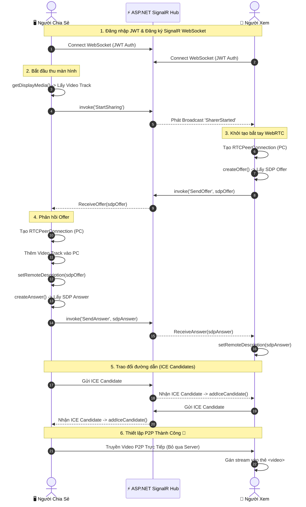

# VAI TRÒ

Bạn là **Senior WebRTC/Real-time Engineer** với 4 năm kinh nghiệm, tiếp tục dự án LMS tốt nghiệp — module Giám sát thi. Sau khi đã sửa xong lỗi bảo mật Hub, wiring trang giám thị, và đếm vi phạm sai (commit `1e054394e23d257ecb8931da1c85696c9818f71d`, `5b7d9194ddc2b8c808e9ba25a0afe9cbe2581e0e`), việc chia sẻ màn hình **vẫn chưa xem được ổn định**. Nhiệm vụ lần này: sửa 3 vấn đề còn lại, phát hiện qua việc đối chiếu với 1 dự án phụ **đã chạy thành công** cùng tính năng.

# BỐI CẢNH — DỰ ÁN THAM CHIẾU ĐÃ CHẠY ĐƯỢC

Trước khi sửa, **bắt buộc phải đọc kỹ** mã nguồn mở tại `https://github.com/Phan-Thanh-Danh/stream.git` (clone về xem trực tiếp, đừng chỉ đọc README suông) — đặc biệt file `README.md` ở gốc repo, vì file này giải thích rõ quy tắc hoạt động, sơ đồ luồng (sequence diagram), và có mục "Giải Thích Chi Tiết Code (Deep Dive)" đi từng bước 1. Toàn bộ README được chép lại nguyên văn ở cuối prompt này để tiện đối chiếu, nhưng nên vẫn tự clone repo thật để xem đúng code (`frontend/src/composables/useWebRtcSharer.ts`, `useWebRtcViewer.ts`), vì code là nguồn chính xác nhất, prompt chỉ trích đoạn liên quan.

Dự án đó dùng đúng kiến trúc bạn đang có (SignalR chỉ làm tín hiệu, video truyền P2P thật qua WebRTC), và đã verify chạy chia sẻ + xem màn hình thành công thật. 3 vấn đề dưới đây là 3 điểm cụ thể dự án đó có mà dự án tốt nghiệp đang thiếu/sai.

---

# VẤN ĐỀ 1 (🔴 khả năng cao nhất là nguyên nhân chính): `ontrack` gán stream ngay khi track còn "muted" → màn hình đen vĩnh viễn

## Mô tả lỗi

`frontend/src/services/webrtcScreenShare.js`, hàm `createProctorPeerConnection`:

```js
pc.ontrack = (event) => {
  if (event.streams && event.streams[0]) {
    onTrack(event.streams[0])   // gán ngay lập tức
  }
}
```

## Nguyên nhân

Theo đặc tả WebRTC, khi `ontrack` bắn lần đầu, track thường ở trạng thái **`muted` tạm thời** (kết nối tín hiệu đã xong, nhưng chưa có gói RTP dữ liệu thực tế nào tới). Gán `MediaStream` chứa track đang muted vào thẻ `<video>` ngay lúc đó khiến nhiều trình duyệt (Chrome/Firefox) **"kẹt" ở khung hình đen/trống vĩnh viễn** — dù sau đó track thực sự có dữ liệu (sự kiện `onunmute` bắn ra), thẻ `<video>` đã gán từ trước không tự vẽ lại nữa.

Dự án `stream` đã từng gặp đúng lỗi này và để lại comment xác nhận (`useWebRtcViewer.ts`):
```ts
// FIX 2: Only publish when track is actually live (not muted).
// Publishing a muted track causes a permanent black screen.
track.onunmute = () => {
  publishStream()
}
if (!track.muted) {
  publishStream()
}
```

## Hậu quả thực tế

Đây rất có thể là nguyên nhân chính khiến giám thị **vẫn không thấy màn hình dù kết nối WebRTC đã thiết lập thành công về mặt tín hiệu** (khác với các lỗi trước — lỗi này xảy ra SAU KHI signaling đã đúng, ở đúng bước cuối cùng gán video).

## Code sửa

Trong `webrtcScreenShare.js`, sửa `createProctorPeerConnection` để chỉ gọi `onTrack` khi track thực sự live, và cũng lắng nghe `onunmute` để publish khi dữ liệu bắt đầu chảy:

```js
pc.ontrack = (event) => {
  const track = event.track
  const stream = event.streams && event.streams[0]
  if (!stream) return

  const publish = () => onTrack(stream)

  if (!track.muted) {
    publish()
  }
  track.onunmute = () => {
    publish()
  }
}
```

Áp dụng tương tự cho bất kỳ chỗ nào khác trong dự án có xử lý `ontrack` (kiểm tra cả phía học sinh nếu có `ontrack` nào tương tự, dù chiều chính là giáo viên nhận stream từ học sinh).

---

# VẤN ĐỀ 2 (🟡): Thiếu TURN server — chỉ có STUN

## Mô tả lỗi

`frontend/src/services/webrtcScreenShare.js`:
```js
iceServers: [
  { urls: ['stun:stun.l.google.com:19302', 'stun:stun1.l.google.com:19302'] }
]
```
Không có TURN server nào.

## Nguyên nhân

STUN chỉ giúp phát hiện địa chỉ công khai để thử nối trực tiếp — không đủ khi 1 trong 2 bên ở sau NAT đối xứng hoặc tường lửa trường học/cơ quan chặn kết nối UDP trực tiếp (rất phổ biến với mạng WiFi trường học). TURN là máy chủ trung chuyển dự phòng bắt buộc phải có cho các trường hợp này.

## Hậu quả thực tế

Sinh viên/giám thị ở 1 số mạng nhất định (tường lửa chặt, NAT khó) sẽ **luôn thất bại** khi thiết lập kết nối P2P, không có candidate nào hoạt động, không có cách nào tự khắc phục nếu không có TURN dự phòng.

## Code sửa — tái dùng đúng cấu hình Coturn đã chạy thành công trong dự án `stream`

**1. Thêm service Coturn vào `docker-compose.yml`** (tham khảo đúng cấu hình đã chạy được trong dự án `stream`):
```yaml
coturn:
  image: coturn/coturn:latest
  restart: unless-stopped
  entrypoint: ["turnserver", "-c", "/etc/coturn/turnserver.conf"]
  ports:
    - "3478:3478/udp"
    - "3478:3478/tcp"
    - "49152-49200:49152-49200/udp"
  volumes:
    - ./turnserver.conf:/etc/coturn/turnserver.conf:ro
```

**2. Tạo file `turnserver.conf`** ở gốc dự án (điều chỉnh `external-ip`/`realm`/`user` theo môi trường thật của bạn, không copy nguyên `192.168.2.3` từ dự án mẫu):
```
listening-port=3478
fingerprint
lt-cred-mech
realm=<ten-mien-hoac-lan-cua-ban>
user=<username>:<password>
no-multicast-peers
log-file=stdout
external-ip=<IP-LAN-hoac-IP-public-cua-server>
min-port=49152
max-port=49200
```

**3. Cập nhật `iceServers` trong `webrtcScreenShare.js`** để thêm TURN bên cạnh STUN hiện có:
```js
iceServers: [
  { urls: ['stun:stun.l.google.com:19302', 'stun:stun1.l.google.com:19302'] },
  {
    urls: 'turn:<IP-LAN-hoac-domain>:3478',
    username: '<username>',
    credential: '<password>'
  }
]
```
Không hard-code username/password thẳng trong file JS commit lên git nếu đây là môi trường thật (không phải LAN dev) — cân nhắc lấy qua biến môi trường/API cấu hình runtime, tương tự cách dự án `stream` có `fetchIceConfig()` lấy cấu hình ICE server động thay vì hard-code cứng trong code — áp dụng cách này nếu phù hợp với kiến trúc hiện có của dự án tốt nghiệp.

---

# VẤN ĐỀ 3 (🟡): Không có hàng chờ (queue) cho ICE candidate đến sớm

## Mô tả lỗi

`frontend/src/views/Student/ExamTakeView.vue` và `frontend/src/views/GiangVien/ProctoringView.vue` gọi thẳng:
```js
await pc.addIceCandidate(new RTCIceCandidate(candidate))
```
không kiểm tra `pc.remoteDescription` đã được set chưa.

## Nguyên nhân

ICE candidate có thể đến qua SignalR **trước khi** `setRemoteDescription` (offer/answer) hoàn tất — đặc biệt dễ xảy ra khi mạng có độ trễ/jitter. Gọi `addIceCandidate` lúc chưa có remote description sẽ ném lỗi, và candidate đó **bị mất luôn**, không được thử lại.

## Hậu quả thực tế

Kết nối có thể thất bại ngẫu nhiên tùy thời điểm gói tin tới, đặc biệt trên mạng chậm — càng dễ xảy ra hơn nếu Vấn đề 2 (thiếu TURN) chưa được xử lý, vì lúc đó cần nhiều candidate hơn để tìm được đường đi tốt.

## Code sửa — theo đúng pattern "Pending Queue" trong dự án `stream`

```typescript
// Từ useWebRtcSharer.ts / useWebRtcViewer.ts của dự án stream:
if (pc.remoteDescription && pc.remoteDescription.type) {
  await pc.addIceCandidate(new RTCIceCandidate(candidate));
} else {
  // Đợi SDP xử lý xong
  pendingCandidates.get(connectionId).push(candidate);
}
```

Áp dụng: thêm 1 `Map` (`pendingCandidates`, key theo `connectionId` của đối phương) ở cả `ExamTakeView.vue` và `ProctoringView.vue` (hoặc gộp chung vào `webrtcScreenShare.js` nếu muốn tái sử dụng logic 1 chỗ):

```js
const pendingCandidates = new Map() // connectionId -> RTCIceCandidateInit[]

async function handleIceCandidate(fromConnectionId, candidate, pc) {
  if (pc.remoteDescription && pc.remoteDescription.type) {
    try {
      await pc.addIceCandidate(new RTCIceCandidate(candidate))
    } catch (e) {
      console.warn('addIceCandidate error', e)
    }
  } else {
    if (!pendingCandidates.has(fromConnectionId)) {
      pendingCandidates.set(fromConnectionId, [])
    }
    pendingCandidates.get(fromConnectionId).push(candidate)
  }
}

// Ngay sau khi setRemoteDescription() (cả ở nơi tạo answer lẫn nơi nhận answer):
const pending = pendingCandidates.get(connectionId) || []
for (const cand of pending) {
  try {
    await pc.addIceCandidate(new RTCIceCandidate(cand))
  } catch (e) {
    console.warn('Error adding pending ICE candidate', e)
  }
}
pendingCandidates.delete(connectionId)
```

---

# RÀNG BUỘC BẮT BUỘC

- Sửa đúng 3 vấn đề theo thứ tự ưu tiên (Vấn đề 1 trước — khả năng cao nhất giải quyết dứt điểm triệu chứng "không thấy màn hình").
- Đọc lại đúng file hiện tại trước khi sửa, không đoán số dòng.
- Vấn đề 2: không được commit thẳng username/password TURN thật lên git nếu là môi trường production — chỉ dùng giá trị mẫu cho LAN dev, nêu rõ cần đổi khi lên production.
- Không đổi kiến trúc tổng thể — chỉ vá đúng 3 lỗ hổng đã nêu, tái dùng đúng pattern đã verify chạy được trong dự án `stream`.

# KẾT QUẢ ĐẦU RA CẦN CÓ

1. `webrtcScreenShare.js` — sửa `ontrack` (Vấn đề 1), thêm TURN vào `iceServers` (Vấn đề 2).
2. `docker-compose.yml` + `turnserver.conf` mới (Vấn đề 2).
3. `ExamTakeView.vue` + `ProctoringView.vue` — thêm hàng chờ ICE candidate (Vấn đề 3).

# BÁO CÁO SAU KHI HOÀN THÀNH

- Với mỗi vấn đề: file/dòng đã sửa, đoạn code trước/sau.
- **Bắt buộc test thủ công thật**: 1 tài khoản học sinh chia sẻ màn hình, xác nhận giám thị thấy được video thật (không phải "Đang chờ màn hình...") — đây là bài test tối thiểu phải qua được trước khi báo cáo hoàn thành, vì đây chính là mục tiêu của cả 3 vấn đề trên.
- Giả định nào phải tự đưa ra do thiếu thông tin (đặc biệt giá trị TURN server dùng cho môi trường của bạn — LAN dev hay production).

---

# PHỤ LỤC — README ĐẦY ĐỦ CỦA DỰ ÁN THAM CHIẾU (`https://github.com/Phan-Thanh-Danh/stream`)

Chép nguyên văn để tiện đối chiếu — nhưng vẫn nên tự clone repo thật để xem code, README chỉ tóm tắt nguyên lý:

## 🌐 WebRTC Real-Time Screen Sharing

**Hệ thống chia sẻ màn hình theo thời gian thực (Real-time Peer-to-Peer Screen Sharing)**

### 🚀 Giới Thiệu

Đây là một hệ thống Screen Sharing hiệu năng cao, được thiết kế để giải quyết bài toán băng thông server khi stream video. Bằng cách kết hợp ASP.NET Core SignalR và WebRTC, dự án mang lại trải nghiệm xem màn hình với độ trễ gần như bằng không.

### ✨ Tính Năng Nổi Bật

- 🎥 Chất lượng Video Cao: Hỗ trợ truyền phát màn hình độ phân giải lên đến 1080p @ 30fps.
- ⚡ Độ Trễ Cực Thấp: Stream video P2P trực tiếp giữa các Client.
- 🛡️ Bảo Mật Tích Hợp: Sử dụng JWT token để xác thực, dữ liệu WebRTC được mã hóa mặc định.
- 🔄 Xử Lý Kết Nối Thông Minh: Tự động phục hồi kết nối SignalR, hàng chờ (queue) ICE Candidate thông minh tránh lỗi bất đồng bộ.
- 🐳 Triển Khai Trong 1 Phút: Đóng gói hoàn chỉnh bằng Docker & Docker Compose kèm theo Coturn server.

### 💡 Nguyên Lý Hoạt Động Cốt Lõi

> **Tuyên Bố Thiết Kế Quan Trọng:**
> 1. SignalR chỉ là "Trợ lý Bắt tay" (Signaling Server): Nhiệm vụ duy nhất của Backend là luân chuyển các gói tin siêu nhẹ gồm SDP Offer, SDP Answer, ICE Candidates và trạng thái Online/Offline.
> 2. TUYỆT ĐỐI KHÔNG TRUYỀN VIDEO QUA SERVER: Toàn bộ luồng hình ảnh/video được truyền trực tiếp giữa 2 trình duyệt thông qua `RTCPeerConnection` của WebRTC.

### 🔄 Sơ Đồ Luồng Hoạt Động (Sequence Diagram)



### 🔬 Giải Thích Chi Tiết Code (Deep Dive)

**1. Khởi tạo & Đăng ký Sự hiện diện (Presence)**
- Frontend (`useSignalR.ts`): Trình duyệt tạo kết nối WebSocket bảo mật tới Hub kèm JWT Token.
- Backend (`StreamHub.cs`): Khi client kết nối (`OnConnectedAsync`), Hub lưu `ConnectionId`, `UserId` vào `ConcurrentDictionary`. Lệnh `Join()` trả về danh sách active sharers.

**2. Người Chia Sẻ bắt đầu thu màn hình**
- Frontend (`useWebRtcSharer.ts`): Sử dụng chuẩn HTML5 `navigator.mediaDevices.getDisplayMedia(...)`.
- Backend: Ghi nhận trạng thái `_activeSharings` và Broadcast `SharerStarted` tới toàn bộ Viewers.

**3. Bắt tay WebRTC (Signaling Process)**
1. Viewer tạo SDP Offer: `pc.createOffer()` -> Gửi qua SignalR `SendOffer`.
2. Sharer nhận Offer: Tạo `RTCPeerConnection` riêng cho Viewer đó, `addTrack()` luồng màn hình vào, gọi `pc.setRemoteDescription()` và `pc.createAnswer()`.
3. Viewer nhận Answer: Áp dụng `pc.setRemoteDescription()`. Kết nối logic được thiết lập.

**4. Hàng chờ ICE Candidate (Xử lý Bất đồng bộ mạng)**
- Vấn đề: ICE Candidates có thể đến trước khi hàm `setRemoteDescription` hoàn tất.
- Giải pháp trong Code: Sử dụng một Pending Queue.
```typescript
if (pc.remoteDescription && pc.remoteDescription.type) {
  await pc.addIceCandidate(new RTCIceCandidate(candidate));
} else {
  pendingCandidates.get(connectionId).push(candidate);
}
```

**5. Phân Định Trách Nhiệm Thư Mục**

| Đường dẫn / Component | Nhiệm vụ chính |
|---|---|
| `Backend/.../StreamHub.cs` | Trạm trung chuyển (Signaling) & Quản lý trạng thái Users. |
| `frontend/.../useWebRtcSharer.ts` | Logic xử lý luồng `getDisplayMedia`, gửi SDP Answer. |
| `frontend/.../useWebRtcViewer.ts` | Logic tự động mở luồng, gửi SDP Offer, nhận Video Stream. |
| `frontend/.../streamStore.ts` | State Management (Pinia) lưu danh sách các Stream đang active. |
