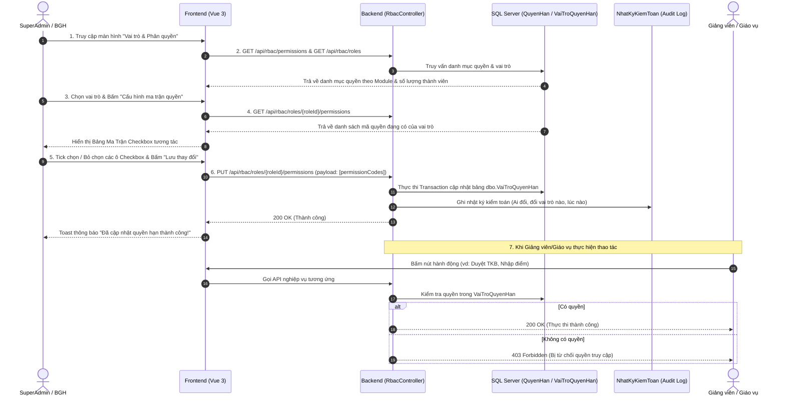

# Kế Hoạch Triển Khai: Ma Trận Phân Quyền Chi Tiết (Permission Matrix) Từ A - Z

## 1. Tổng Quan & Phân Định Quyền Hạn Của Các Role

| Role (Vai trò) | Màn hình truy cập | Quyền hạn trên Ma trận Phân quyền |
| :--- | :--- | :--- |
| **👑 SuperAdmin (Siêu quản trị)** | `/super-admin/roles-permissions` | **Toàn quyền (Full Access)**: Xem, cấu hình, bật/tắt mọi quyền cho tất cả các vai trò trong toàn hệ thống, tạo vai trò mới, gán quyền hàng loạt. |
| **🏛️ Ban Giám Hiệu (BGH)** | `/bgh/roles` | **Quản trị cơ sở (Campus Scope)**: Xem danh mục vai trò, xem chi tiết ma trận quyền hạn của cơ sở, tùy chỉnh quyền hạn cho các vai trò học vụ trực thuộc (*Giáo vụ, Giảng viên...*). |
| **👨‍🏫 Giảng viên, 🏢 Giáo vụ, 🎓 Sinh viên, 👨‍👩‍👧 Phụ huynh** | Không truy cập trang cấu hình quyền | **Đối tượng thụ hưởng quyền**: Giao diện (nút bấm, menu) và API sẽ tự động mở hoặc khóa dựa trên ma trận quyền mà SuperAdmin/BGH đã cấp. |

---

## 2. Quy Trình Nghiệp Vụ Từ A - Z (Workflow)



---

## 3. Thiết Kế Giao Diện & Chi Tiết Các Nút Bấm

### 3.1 Màn hình Danh Mục Vai Trò
- **Thẻ thống kê trên cùng**: Tổng số vai trò, Tổng thành viên, Phân bổ nhân sự.
- **Bảng danh sách vai trò**: 
  - Tên vai trò, Mã code (`giao_vien`, `nhan_vien`, `hieu_truong`...).
  - Số lượng thành viên thuộc cơ sở.
  - Cột Hành động gồm các nút:
    - 👁️ **"Xem thành viên"**: Mở Drawer danh sách tài khoản (đã làm ở bước trước, có search + phân trang).
    - ⚙️ **"Phân quyền / Ma trận"**: Mở Drawer/Modal **Cấu hình Ma Trận Phân Quyền**.

---

### 3.2 Modal / Drawer "Ma Trận Phân Quyền Chi Tiết (Permission Matrix)"
Khi bấm nút **"Phân quyền / Ma trận"**, một Modal/Drawer lớn mở ra với giao diện bảng 2 chiều:

```text
+---------------------------------------------------------------------------------------------------------+
|  🛡️ MA TRẬN PHÂN QUYỀN — VAI TRÒ: GIÁO VỤ (nhan_vien)                                             [ X ] |
|  Cấu hình chi tiết các hành động được phép thực hiện trên từng phân hệ hệ thống                         |
+---------------------------------------------------------------------------------------------------------+
| [ Tìm kiếm quyền...           ]                           [ Bật tất cả ]  [ Tắt tất cả ]  [ Mặc định ]  |
+---------------------------------------------------------------------------------------------------------+
| Phân hệ / Tài nguyên     |  Xem (Read) | Thêm (Create) | Sửa (Update) | Xóa (Delete) | Đặc thù / Duyệt  |
+--------------------------+-------------+---------------+--------------+--------------+------------------+
| 👤 Tài khoản & Nhân sự   |     [x]     |      [x]      |     [x]      |     [ ]      | [x] Import Excel |
| 🏛️ Cơ sở & Phòng học     |     [x]     |      [ ]      |     [ ]      |     [ ]      |       ---        |
| 📚 Đào tạo & Khung CT    |     [x]     |      [x]      |     [x]      |     [ ]      | [x] Quản lý môn  |
| 📝 Khảo thí & Điểm số    |     [x]     |      [x]      |     [ ]      |     [ ]      | [ ] Mở khóa điểm |
| 📅 Thời khóa biểu        |     [x]     |      [x]      |     [x]      |     [ ]      | [ ] Duyệt TKB    |
| 📨 Đơn từ & Hỗ trợ       |     [x]     |      [ ]      |     [x]      |     [ ]      | [x] Xử lý đơn    |
| 📊 Báo cáo & Thống kê    |     [x]     |      ---      |     ---      |     ---      | [x] Xuất Excel   |
+---------------------------------------------------------------------------------------------------------+
| [ 🔄 Khôi phục mặc định ]                                            [ Hủy bỏ ]   [ 💾 Lưu thay đổi ]   |
+---------------------------------------------------------------------------------------------------------+
```

#### Chi tiết các nút bấm trong Ma trận quyền:
1. **Nút checkbox từng ô `[x] / [ ]`**: Click trực tiếp để cấp hoặc thu hồi quyền cụ thể.
2. **Nút "Bật tất cả (Select All)" / "Tắt tất cả (Deselect All)"**: Thao tác nhanh cho toàn bộ hàng hoặc toàn bộ bảng.
3. **Nút "Khôi phục mặc định (Reset to Default)"**: Đưa ma trận về cấu hình quyền khuyến nghị ban đầu của hệ thống.
4. **Nút "Hủy bỏ (Cancel)"**: Đóng modal mà không lưu các thay đổi chưa xác nhận.
5. **Nút "Lưu thay đổi (Save Changes)"**:
   - Khi bấm: Hiển thị icon xoay loading `Đang lưu...`.
   - Gọi API `PUT /api/rbac/roles/{roleId}/permissions` gửi danh sách mã quyền mới.
   - Khi thành công: Hiện Toast màu xanh thông báo *"Đã cập nhật quyền thành công!"* và tự động đóng modal hoặc giữ nguyên trạng thái mới.

---

## 4. Kiến Trúc CSDL & API Backend (Zero-Mock)

### 4.1 Mô Hình CSDL (SQL Server)
```sql
-- 1. Bảng Danh mục Quyền Hạn
CREATE TABLE dbo.QuyenHan (
    ma_quyen_han INT IDENTITY(1,1) PRIMARY KEY,
    ma_code NVARCHAR(100) NOT NULL UNIQUE,       -- vd: 'schedules.approve', 'exams.grade'
    ten_quyen_han NVARCHAR(200) NOT NULL,        -- vd: 'Phê duyệt Thời khóa biểu'
    module NVARCHAR(50) NOT NULL,                -- vd: 'schedules', 'exams', 'accounts'
    action NVARCHAR(50) NOT NULL,                -- vd: 'read', 'create', 'update', 'delete', 'approve'
    mo_ta NVARCHAR(500) NULL
);

-- 2. Bảng Quan hệ Vai trò - Quyền hạn
CREATE TABLE dbo.VaiTroQuyenHan (
    ma_vai_tro INT NOT NULL FOREIGN KEY REFERENCES dbo.VaiTro(ma_vai_tro) ON DELETE CASCADE,
    ma_quyen_han INT NOT NULL FOREIGN KEY REFERENCES dbo.QuyenHan(ma_quyen_han) ON DELETE CASCADE,
    ngay_cap DATETIME NOT NULL DEFAULT GETUTCDATE(),
    nguoi_cap INT NULL FOREIGN KEY REFERENCES dbo.NguoiDung(ma_nguoi_dung),
    CONSTRAINT PK_VaiTroQuyenHan PRIMARY KEY (ma_vai_tro, ma_quyen_han)
);
```

### 4.2 Danh Sách Endpoint Backend
- `GET /api/rbac/permissions`: Trả về danh sách ~30 quyền được gom nhóm theo 7 Module.
- `GET /api/rbac/roles/{roleId}/permissions`: Trả về mảng các `permissionCodes` mà vai trò đang có.
- `PUT /api/rbac/roles/{roleId}/permissions`: Cập nhật ma trận quyền cho vai trò (chỉ SuperAdmin/BGH mới được gọi, có ghi Audit Log).

---

## 5. Kế Hoạch Xác Minh & Kiểm Thử

1. **Test Tạo & Seed CSDL**:
   - Tạo migration EF Core và seed đầy đủ 30 quyền chuẩn kèm phân quyền mặc định cho các vai trò.
2. **Test Thao Tác UI & API**:
   - Đăng nhập tài khoản BGH/SuperAdmin.
   - Mở modal ma trận quyền của vai trò *Giáo vụ*.
   - Bật quyền `schedules.approve` $\rightarrow$ Bấm **Lưu thay đổi**.
   - F5 tải lại trang $\rightarrow$ Kiểm tra ô checkbox `schedules.approve` vẫn được tick đúng từ database.
3. **Test Kiểm Toán (Audit Log)**:
   - Mở màn hình Nhật ký kiểm toán (`/bgh/audit-logs`) $\rightarrow$ Thấy bản ghi `UPDATE_ROLE_PERMISSIONS` vừa thực hiện.
4. **Build & Docker Verification**:
   - Chạy `dotnet build`, `npm run build` không lỗi.
   - Rebuild Docker container để đảm bảo hệ thống hoạt động đồng bộ.
