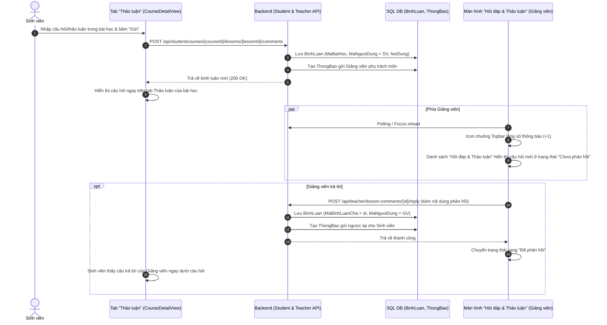

# Kế Hoạch: Tinh Gọn & Đồng Bộ Luồng 'Hỏi Đáp & Thảo Luận Bài Học' (Giảng Viên & Sinh Viên)

Kế hoạch này giải quyết triệt để sự trùng lặp giữa "Câu hỏi sinh viên" và "Bình luận bài học", thống nhất thành một tính năng duy nhất: **Hỏi đáp & Thảo luận bài học**.

---

## 1. Bản chất & Đề xuất tinh gọn

### Hiện trạng:
- Ở phía **Sinh viên** (`CourseDetailView.vue`): Dưới mỗi bài học chỉ có **duy nhất 1 tab "Thảo luận"** để sinh viên nhập câu hỏi thắc mắc hoặc trao đổi.
- Ở phía **Giảng viên** (`menuData.js`): Lại tách thành 2 menu riêng biệt là *"Câu hỏi học sinh"* (`/teacher/student-questions`) và *"Bình luận bài học"* (`/teacher/lesson-comments`). Cả 2 đều truy vấn từ cùng bảng dữ liệu `BinhLuan`.

### Đề xuất giải pháp:
- **Gộp thành 1 mục duy nhất** trên Sidebar Giảng viên: **"Hỏi đáp & Thảo luận"** (icon `MessageSquare`, trỏ tới `/teacher/discussions` hoặc `/teacher/lesson-comments`).
- Sử dụng giao diện luồng trao đổi dạng Thread hiện đại (với đầy đủ bộ lọc *Chưa phản hồi / Đã phản hồi*, *Lọc theo từng bài học*, *Tìm kiếm*, *Thống kê*, *Khung trả lời trực tiếp*).
- Xóa bỏ mục menu thừa trên sidebar.

---

## 2. Luồng nghiệp vụ thống nhất



---

## 3. Danh sách thay đổi chi tiết

### A. Backend

1. **[Backend/Controllers/StudentCoursesController.cs](file:///d:/A/Du-An-Tot-Nghiep/Backend/Controllers/StudentCoursesController.cs)**:
   - Cập nhật `GET {courseId}/lessons/{lessonId}/comments`: Trả về danh sách bình luận kèm tên tác giả thật, avatar viết tắt, thời gian tạo, và danh sách các câu trả lời (`Replies`).
   - Bổ sung `POST {courseId}/lessons/{lessonId}/comments`:
     - Nhận `Content` từ sinh viên $\rightarrow$ Lưu `BinhLuan`.
     - Tự động xác định giảng viên phụ trách môn học $\rightarrow$ Tạo `ThongBao` gửi cho giảng viên (`Sinh viên [Tên] vừa gửi câu hỏi trong bài học [Tên bài]`).

2. **[Backend/Controllers/TeacherCommunicationsController.cs](file:///d:/A/Du-An-Tot-Nghiep/Backend/Controllers/TeacherCommunicationsController.cs)**:
   - Cập nhật `GET /api/teacher/lesson-comments`:
     - Trả về danh sách bình luận kèm trạng thái `Replied` (đã phản hồi / chưa phản hồi), tên bài học, tên môn học, thông tin sinh viên, và các câu trả lời.
   - Cập nhật `POST /api/teacher/lesson-comments/{commentId}/reply`:
     - Lưu câu trả lời của giảng viên vào bảng `BinhLuan` (`MaBinhLuanCha = commentId`).
     - Tự động tạo `ThongBao` gửi cho sinh viên (`Giảng viên vừa trả lời câu hỏi của bạn trong bài học...`).

### B. Frontend

1. **[frontend/src/components/GiangVien/data/menuData.js](file:///d:/A/Du-An-Tot-Nghiep/frontend/src/components/GiangVien/data/menuData.js)**:
   - Tinh gọn nhóm "Thảo luận": Bỏ 2 mục con thừa, gộp thành 1 mục duy nhất:
     ```javascript
     {
       id: 'tuong-tac',
       label: 'Hỏi đáp & Thảo luận',
       icon: 'MessageSquare',
       route: '/teacher/discussions',
     }
     ```

2. **[frontend/src/router/index.js](file:///d:/A/Du-An-Tot-Nghiep/frontend/src/router/index.js)**:
   - Khai báo route `/teacher/discussions` trỏ tới `LessonCommentsView.vue` (và giữ alias redirect cho `/teacher/student-questions` và `/teacher/lesson-comments` để tránh 404).

3. **[frontend/src/services/studentApi.js](file:///d:/A/Du-An-Tot-Nghiep/frontend/src/services/studentApi.js)**:
   - Thêm hàm `addLessonComment(courseId, lessonId, payload)`.

4. **[frontend/src/views/Student/CourseDetailView.vue](file:///d:/A/Du-An-Tot-Nghiep/frontend/src/views/Student/CourseDetailView.vue)**:
   - Gắn sự kiện gửi câu hỏi/bình luận vào nút "Gửi" (`@click="sendComment"`) và `@keyup.enter`.
   - Hiển thị phản hồi từ Giảng viên (nếu có) dưới từng bình luận.

5. **[frontend/src/views/GiangVien/LessonCommentsView.vue](file:///d:/A/Du-An-Tot-Nghiep/frontend/src/views/GiangVien/LessonCommentsView.vue)**:
   - Đổi tiêu đề trang thành **"Hỏi đáp & Thảo luận bài học"**.
   - Thêm auto-refresh khi focus cửa sổ hoặc định kỳ 15s.
   - Thêm nút "Làm mới" dữ liệu tức thì.

---

## 4. Kế hoạch xác minh

1. **Automated Test:** Chạy test C# kiểm tra luồng API Sinh viên gửi bình luận $\rightarrow$ Giảng viên nhận thông báo $\rightarrow$ Giảng viên trả lời $\rightarrow$ Sinh viên nhận phản hồi.
2. **Build Test:** Chạy `dotnet build` và `npm run build`.
3. **Docker Update:** Rebuild container Backend Docker và kiểm tra giao diện trên trình duyệt.
