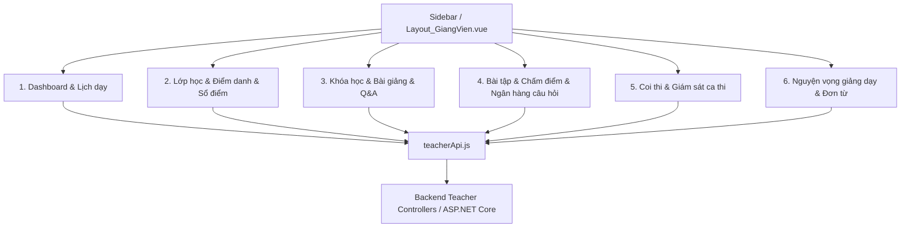

# Kế Hoạch & Bản Đồ Tài Nguyên Phân Hệ Giảng Viên (Teacher Role Architecture)

Tài liệu này tổng hợp đầy đủ cấu trúc các file, giao diện, API và dữ liệu thuộc **Phân hệ Giảng viên (Teacher/Giảng viên)** trong hệ thống LMS Academic Management System.

---

## 🏗️ 1. Cấu Trúc Tổng Quan Phân Hệ Giảng Viên

---

## 🎨 2. Frontend: Danh Sách File & Nhóm Nghiệp Vụ (32 Views + Layout + Service)

### File Nền Tảng:
- **Layout**: [Layout_GiangVien.vue](file:///d:/A/Du-An-Tot-Nghiep/frontend/src/components/GiangVien/Layout_GiangVien.vue) (Khung giao diện chung Giảng viên)
- **API Service**: [teacherApi.js](file:///d:/A/Du-An-Tot-Nghiep/frontend/src/services/teacherApi.js) (Tập trung toàn bộ API calls cho Teacher)
- **Router Config**: [index.js](file:///d:/A/Du-An-Tot-Nghiep/frontend/src/router/index.js) (Khu vực route `/teacher` hoặc `/giang-vien`)

---

### Nhóm 1: Tổng Quan & Lịch Giảng Dạy (Dashboard & Schedule)
1. [Dashboard.vue](file:///d:/A/Du-An-Tot-Nghiep/frontend/src/views/GiangVien/Dashboard.vue) - Tổng quan hoạt động dạy học, lịch hôm nay, thông báo & nhắc nhở.
2. [TeachingScheduleView.vue](file:///d:/A/Du-An-Tot-Nghiep/frontend/src/views/GiangVien/TeachingScheduleView.vue) - Lịch giảng dạy theo tuần / học kỳ, phòng học & ca dạy.

---

### Nhóm 2: Lớp Học, Điểm Danh & Sổ Điểm (Classes, Attendance & Grades)
3. [ClassListView.vue](file:///d:/A/Du-An-Tot-Nghiep/frontend/src/views/GiangVien/ClassListView.vue) - Danh sách các lớp học phần phụ trách.
4. [ClassDetailView.vue](file:///d:/A/Du-An-Tot-Nghiep/frontend/src/views/GiangVien/ClassDetailView.vue) - Chi tiết lớp học phần.
5. [ClassWorkspaceView.vue](file:///d:/A/Du-An-Tot-Nghiep/frontend/src/views/GiangVien/ClassWorkspaceView.vue) - Khu vực làm việc tổng hợp của lớp.
6. [ClassAttendanceView.vue](file:///d:/A/Du-An-Tot-Nghiep/frontend/src/views/GiangVien/ClassAttendanceView.vue) - Điểm danh danh sách sinh viên theo buổi học.
7. [AttendanceHistoryView.vue](file:///d:/A/Du-An-Tot-Nghiep/frontend/src/views/GiangVien/AttendanceHistoryView.vue) - Lịch sử điểm danh các buổi đã gửi/khóa.
8. [ClassGradesView.vue](file:///d:/A/Du-An-Tot-Nghiep/frontend/src/views/GiangVien/ClassGradesView.vue) - Quản lý nhập điểm sinh viên.
9. [ClassGradebookView.vue](file:///d:/A/Du-An-Tot-Nghiep/frontend/src/views/GiangVien/ClassGradebookView.vue) - Sổ điểm tổng hợp chi tiết theo thành phần điểm.
10. [ClassProgressView.vue](file:///d:/A/Du-An-Tot-Nghiep/frontend/src/views/GiangVien/ClassProgressView.vue) - Tiến độ hoàn thành bài học của lớp.
11. [ClassProgressListView.vue](file:///d:/A/Du-An-Tot-Nghiep/frontend/src/views/GiangVien/ClassProgressListView.vue) - Báo cáo tiến độ học tập danh sách sinh viên.

---

### Nhóm 3: Môn Học, Bài Giảng & Giải Đáp Thắc Mắc (Lessons & Q&A)
12. [CoursesView.vue](file:///d:/A/Du-An-Tot-Nghiep/frontend/src/views/GiangVien/CoursesView.vue) - Danh sách môn học đảm nhận.
13. [TeacherLessonCoursesView.vue](file:///d:/A/Du-An-Tot-Nghiep/frontend/src/views/GiangVien/TeacherLessonCoursesView.vue) - Khóa học gắn liền với nội dung bài giảng.
14. [LessonsView.vue](file:///d:/A/Du-An-Tot-Nghiep/frontend/src/views/GiangVien/LessonsView.vue) - Soạn thảo và quản lý bài giảng, video, tài liệu.
15. [LessonCommentsView.vue](file:///d:/A/Du-An-Tot-Nghiep/frontend/src/views/GiangVien/LessonCommentsView.vue) - Quản lý bình luận, trao đổi bài học.
16. [StudentQuestionsView.vue](file:///d:/A/Du-An-Tot-Nghiep/frontend/src/views/GiangVien/StudentQuestionsView.vue) - Hòm thư giải đáp câu hỏi của sinh viên.

---

### Nhóm 4: Ngân Hàng Câu Hỏi, Kiểm Tra & Chấm Bài Tập (Exams & Assignments)
17. [QuestionBankView.vue](file:///d:/A/Du-An-Tot-Nghiep/frontend/src/views/GiangVien/QuestionBankView.vue) - Ngân hàng câu hỏi trắc nghiệm / tự luận.
18. [CreateQuestionView.vue](file:///d:/A/Du-An-Tot-Nghiep/frontend/src/views/GiangVien/CreateQuestionView.vue) - Tạo mới / chỉnh sửa câu hỏi kiểm tra.
19. [ExamResultsView.vue](file:///d:/A/Du-An-Tot-Nghiep/frontend/src/views/GiangVien/ExamResultsView.vue) - Kết quả làm bài thi / kiểm tra của sinh viên.
20. [GradingCourseListView.vue](file:///d:/A/Du-An-Tot-Nghiep/frontend/src/views/GiangVien/GradingCourseListView.vue) - Danh sách lớp/khóa cần chấm điểm bài nộp.
21. [AssignmentCoursesView.vue](file:///d:/A/Du-An-Tot-Nghiep/frontend/src/views/GiangVien/AssignmentCoursesView.vue) - Quản lý bài tập theo môn học.
22. [AssignmentListView.vue](file:///d:/A/Du-An-Tot-Nghiep/frontend/src/views/GiangVien/AssignmentListView.vue) - Danh sách bài tập lớn / bài về nhà.
23. [AssignmentSubmissionsView.vue](file:///d:/A/Du-An-Tot-Nghiep/frontend/src/views/GiangVien/AssignmentSubmissionsView.vue) - Giao diện chấm bài nộp, cho điểm và nhận xét chi tiết.

---

### Nhóm 5: Coi Thi & Giám Sát Phòng Thi (Proctoring)
24. [ProctoringDashboardView.vue](file:///d:/A/Du-An-Tot-Nghiep/frontend/src/views/GiangVien/ProctoringDashboardView.vue) - Dashboard tổng quan ca coi thi được phân công.
25. [ProctoringSessionsView.vue](file:///d:/A/Du-An-Tot-Nghiep/frontend/src/views/GiangVien/ProctoringSessionsView.vue) - Danh sách các ca thi coi thi.
26. [ProctoringAttendanceView.vue](file:///d:/A/Du-An-Tot-Nghiep/frontend/src/views/GiangVien/ProctoringAttendanceView.vue) - Điểm danh thí sinh vào phòng thi.
27. [ProctoringReportView.vue](file:///d:/A/Du-An-Tot-Nghiep/frontend/src/views/GiangVien/ProctoringReportView.vue) - Lập biên bản xử lý vi phạm quy chế thi.

---

### Nhóm 6: Nguyện Vọng Giảng Dạy & Đơn Từ Cá Nhân (Preferences & Administrative Requests)
28. [TeachingPreferencesView.vue](file:///d:/A/Du-An-Tot-Nghiep/frontend/src/views/GiangVien/TeachingPreferencesView.vue) - Đăng ký nguyện vọng ca dạy / ngày dạy với Giáo vụ.
29. [PendingRequestsView.vue](file:///d:/A/Du-An-Tot-Nghiep/frontend/src/views/GiangVien/PendingRequestsView.vue) - Đơn xin đổi lịch dạy / xin dạy bù / mở lại điểm danh chờ duyệt.
30. [RequestsHistoryView.vue](file:///d:/A/Du-An-Tot-Nghiep/frontend/src/views/GiangVien/RequestsHistoryView.vue) - Lịch sử xử lý đơn từ.
31. [ProfileView.vue](file:///d:/A/Du-An-Tot-Nghiep/frontend/src/views/GiangVien/ProfileView.vue) - Hồ sơ thông tin cá nhân giảng viên.
32. [ChangePasswordView.vue](file:///d:/A/Du-An-Tot-Nghiep/frontend/src/views/GiangVien/ChangePasswordView.vue) - Đổi mật khẩu tài khoản.

---

## ⚙️ 3. Backend: Danh Sách Controller & Service Xử Lý

### Backend Controllers (`Backend/Controllers/`):
- `TeacherDashboardController.cs` - API Thống kê tổng quan & Lịch học hôm nay (`/api/teacher/dashboard`, `/api/teacher/schedule/today`).
- `TeacherScheduleController.cs` - API Lịch giảng dạy & Tóm tắt học kỳ (`/api/teacher/schedule/summary`, `/api/teacher/schedule/terms`).
- `TeacherClassesController.cs` - API Danh sách & Chi tiết lớp học phần (`/api/teacher/classes/...`).
- `TeacherAttendanceHistoryController.cs` - API Lịch sử điểm danh (`/api/teacher/attendance/...`).
- `TeacherSubmissionsController.cs` - API Quản lý bài tập & Chấm bài nộp (`/api/teacher/submissions/...`).
- `TeacherExamResultsController.cs` - API Quản lý kết quả thi & kiểm tra (`/api/teacher/exam-results/...`).
- `TeacherExamController.cs` - API Coi thi & Lập biên bản vi phạm (`/api/teacher/exams/...`).
- `TeacherTeachingPreferencesController.cs` - API Nguyện vọng giảng dạy (`/api/teacher/teaching-preferences/...`).
- `TeacherRequestsController.cs` - API Đơn xin đổi lịch / dạy bù (`/api/teacher/requests/...`).
- `TeacherCommunicationsController.cs` - API Trao đổi & Giải đáp thắc mắc sinh viên (`/api/teacher/communications/...`).

### Backend Services (`Backend/Services/`):
- `TeacherScheduleService.cs` / `ITeacherScheduleService.cs` - Xử lý logic tính toán lịch dạy.
- `TeacherAcademicWorkloadService.cs` / `ITeacherAcademicWorkloadService.cs` - Quản lý số giờ/tải giảng dạy.
- `CourseTeacherEligibilityService.cs` - Kiểm tra điều kiện phân công giảng dạy.

---

## 🧪 Plan Xác Nhận & Quy Trình Triển Khai Task

1. **Chuẩn bị dữ liệu Test**:
   - Sử dụng tài khoản Giảng viên chuẩn: `p12test_teacher01@lms.local` (Mật khẩu: `Test@123`) hoặc `teacher.cntt@lms.local` (Mật khẩu: `123456`).
2. **Định hướng thực hiện**:
   - Duyệt qua từng giao diện trong 32 Views của Giảng viên.
   - Sửa lỗi UI/UX, tối ưu hóa API kết nối DB thật, nâng cấp trải nghiệm người dùng theo các Semantic Tokens và Glassmorphism.
   - Kiểm tra linting (`npx oxlint`) và build test kỹ lưỡng sau mỗi bước.
