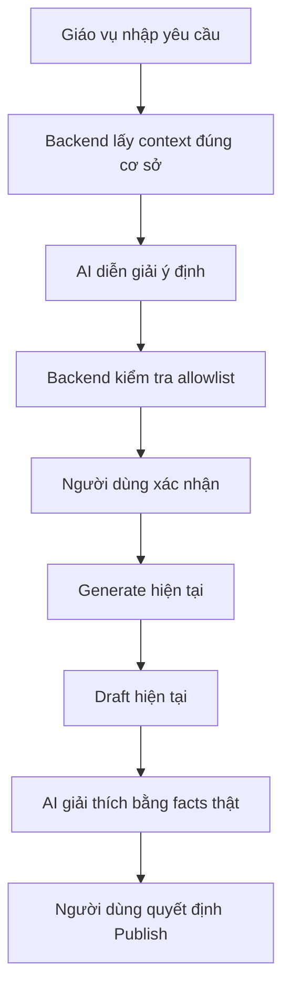

# TASK 7E — AI ASSISTANT FOR SMART TIMETABLE

> **Quyết định kiến trúc đã chốt:** Task 7E không huấn luyện hoặc fine-tune model để tự học cách xếp lịch. Qwen chỉ hiểu yêu cầu tiếng Việt, chọn profile trong allowlist và giải thích kết quả. Toàn bộ việc tạo thời khóa biểu vẫn do thuật toán Generate/GA hiện có thực hiện trên dữ liệu thật và các hard/soft constraints đã được kiểm chứng.

> **Hạ tầng thực tế:** Backend ASP.NET Core chạy trong Docker trên VPS; Ollama chạy trên máy Windows cá nhân. Backend tái sử dụng `OllamaService.cs` hiện có và gọi trực tiếp Ollama REST API cổng `11434` qua IP Tailscale. Không thêm FastAPI, Python service hoặc một Ollama gateway thứ hai.

## 1. Mục tiêu

Task 7E bổ sung một trợ lý AI bằng tiếng Việt cho quy trình Smart Timetable đã hoàn thiện. AI giúp Giáo vụ:

- nói yêu cầu bằng ngôn ngữ tự nhiên;
- hiểu học kỳ và tình trạng sẵn sàng của chính cơ sở đang công tác;
- giải thích dữ liệu còn thiếu và hướng dẫn cách khắc phục;
- lựa chọn một hồ sơ tối ưu được Backend cho phép;
- xác nhận trước khi gọi luồng Generate hiện tại;
- theo dõi tiến trình bằng thông báo dễ hiểu;
- tóm tắt và giải thích bản nháp trước khi người dùng duyệt.

Task này **không thay thế thuật toán xếp lịch**, không viết lại Generate/Draft/Publish và không trao quyền quyết định nghiệp vụ cho mô hình AI.

Nói ngắn gọn, AI “mượn” engine xếp lịch hiện có theo luồng:

> Ngôn ngữ tự nhiên → profile an toàn → người dùng xác nhận → Generate/GA hiện có → Draft → facts do Backend tính → AI giải thích.

## 2. Kết quả cuối cùng mong muốn

Một Giáo vụ không am hiểu kỹ thuật có thể nhập:

> Xếp lịch học kỳ tới, ưu tiên sinh viên ít bị trống tiết và hạn chế ca tối.

Hệ thống phải:

1. Lấy cơ sở từ tài khoản AcademicStaff đang đăng nhập.
2. Lấy học kỳ được phép xếp từ `AcademicSchedulingContext`.
3. Kiểm tra readiness và các khóa bảo vệ hiện tại.
4. Nhờ AI diễn giải yêu cầu thành một cấu hình thuộc allowlist.
5. Hiển thị lại chính xác AI đã hiểu gì.
6. Yêu cầu người dùng xác nhận.
7. Sau xác nhận, gọi đúng Generate hiện tại một lần.
8. Đưa kết quả vào Draft hiện tại.
9. Giải thích Draft bằng số liệu do Backend xác minh.
10. Để người dùng tự quyết định Publish bằng luồng hiện tại.



## 3. Nguyên tắc kiến trúc bắt buộc

### 3.1. Backend vẫn là nguồn chân lý

- Campus, term, role và readiness lấy từ Backend.
- Hard constraints do Backend/solver kiểm tra.
- AI output chỉ là đề xuất và phải được validate.
- AI không được gọi SQL hoặc truy cập `ApplicationDbContext` trực tiếp.
- AI không được tự tạo dữ liệu nghiệp vụ.

### 3.2. AI là lớp giao tiếp và giải thích

AI được phép:

- hiểu câu tiếng Việt;
- phân loại ý định;
- chọn profile nằm trong allowlist;
- giải thích reason code;
- tóm tắt số liệu đã được Backend tính;
- hướng dẫn người dùng đến màn hình khắc phục phù hợp.
- giải thích quyết định của solver bằng từng fact đã được Backend xác minh, nhưng không tự thay đổi quyết định đó.

AI không được phép:

- tự Generate khi người dùng chưa xác nhận;
- tự Publish trong mọi trường hợp;
- tự đổi cơ sở hoặc học kỳ;
- phá readiness hoặc hard constraint;
- vượt khóa 30 phút hoặc khóa điểm danh;
- tự đặt Draft ID, course ID, teacher ID hoặc room ID tùy ý;
- tự sinh trọng số GA thô;
- xóa Draft, TKB, BuoiHoc hoặc DiemDanh;
- gửi dữ liệu của cơ sở khác;
- tuyên bố đã chọn giảng viên tốt nhất nếu solver vẫn dùng `KhoaHoc.MaGiaoVien` cố định.

Nếu solver hiện có hỗ trợ chọn giảng viên từ candidate thật, phần giải thích phải dựa trên các thành phần như độ phù hợp môn/kỹ năng, kinh nghiệm, số lần đã dạy môn, trạng thái hoạt động, availability và workload. Không tái sử dụng một giá trị `MucDoPhuHop` tổng hợp đã lưu như bằng chứng duy nhất hoặc để AI tự suy đoán lý do phân công.

### 3.3. AI là tính năng tùy chọn

Nếu Ollama bị tắt, thiếu model, timeout hoặc trả dữ liệu sai:

- trang Smart Timetable vẫn tải bình thường;
- nút **Xếp lịch ngay** vẫn hoạt động bằng luồng cũ;
- người dùng nhận thông báo dễ hiểu;
- không phát sinh Job/Draft ngoài ý muốn;
- không giữ lock hoặc request gate bị kẹt.

## 4. Phạm vi người dùng

### Trong phạm vi

- Role nghiệm thu: `AcademicStaff`.
- AcademicStaff chỉ làm việc với cơ sở trong token/context đăng nhập.
- UI AI chỉ xuất hiện trong khu vực Smart Timetable của Giáo vụ.

### Ngoài phạm vi

- SuperAdmin không dùng để nghiệm thu và không demo.
- Student, Teacher, Parent không có quyền ra lệnh xếp lịch.
- AI chatbot toàn hệ thống LMS không thuộc Task 7E.
- AI tự phân công hoặc thay đổi giảng viên không thuộc Task 7E v1.
- Embedding, vector database và RAG không thuộc acceptance gate của Task 7E v1.
- Không sửa thuật toán GA để làm AI có vẻ thông minh hơn.

Nếu phát hiện lỗi chỉ thuộc SuperAdmin, ghi nhận trong báo cáo nhưng không sửa, trừ khi lỗi đó ảnh hưởng code dùng chung, bảo mật, build hoặc AcademicStaff.

## 5. Hồ sơ tối ưu được phép

AI chỉ được chọn một trong các profile do Backend công bố:

| Profile | Ý nghĩa cho người dùng | Backend kiểm soát |
|---|---|---|
| `balanced` | Cân bằng giảng viên, sinh viên và phòng | Toàn bộ trọng số và giới hạn |
| `teacher_friendly` | Ưu tiên nguyện vọng, giảm khe trống và dồn tải giảng viên | Trọng số preference/workload |
| `student_friendly` | Giảm ca tối, thứ Bảy và khe trống của lớp | Trọng số student comfort |

AI không được trả về `populationSize`, `generations`, `mutationRate`, `crossoverRate` hoặc các fitness weight. Nếu cần thay đổi kỹ thuật, Backend ánh xạ profile sang cấu hình nội bộ.

## 6. Dữ liệu được phép gửi sang Ollama

| Được phép | Bị cấm |
|---|---|
| Tên hiển thị của cơ sở | JWT, refresh token, cookie |
| Mã/tên học kỳ | Password, API key, connection string |
| Số khóa học cần xếp | Tên, email hoặc mã sinh viên |
| Số phòng/ca đang hoạt động | Điểm, học phí, hồ sơ cá nhân |
| Readiness code và mô tả tổng hợp | Chi tiết điểm danh cá nhân |
| Số liệu tổng hợp Draft | Dữ liệu cơ sở khác |
| Danh sách profile cho phép | Raw database row không cần thiết |
| Facts đã được Backend xác minh | Prompt/log chứa bí mật |

Backend phải tạo một context tối thiểu dành riêng cho AI; không serialize trực tiếp entity hoặc toàn bộ response nghiệp vụ sang Ollama.

## 7. API/contract dự kiến

Tên endpoint có thể điều chỉnh sau Task 7E-0 nếu dự án đã có AI controller dùng chung, nhưng semantics không được thay đổi.

Các endpoint dưới đây thuộc Backend ASP.NET Core trên VPS. Backend gọi `OllamaService.cs`; trình duyệt không gọi trực tiếp Ollama và không biết IP Tailscale của máy AI.

### 7.1. Health

`GET /api/ai/scheduling/health`

Mục đích:

- kiểm tra AI sẵn sàng;
- không gọi Generate;
- không mutation database;
- không trả thông tin bí mật hoặc địa chỉ Ollama nội bộ.

### 7.2. Interpret

`POST /api/ai/scheduling/interpret`

Request tối thiểu:

```json
{
  "message": "Ưu tiên sinh viên ít trống tiết và hạn chế ca tối"
}
```

Response đã được Backend validate:

```json
{
  "intent": "prepare_schedule",
  "profile": "student_friendly",
  "scope": "all_schedulable_courses",
  "summary": "Xếp toàn bộ khóa học của học kỳ được phép theo hướng thuận tiện cho sinh viên.",
  "requestedPreferences": [
    "reduce_student_gaps",
    "avoid_evening_shifts"
  ],
  "requiresConfirmation": true,
  "contextVersion": "opaque-version"
}
```

Endpoint này không được Generate, Publish hoặc tạo Job/Draft.

### 7.3. Explain Draft

`POST /api/ai/scheduling/explain-draft`

- Backend kiểm tra Draft thuộc đúng AcademicStaff/campus/term.
- Backend tính `DraftFacts` trước.
- Ollama chỉ chuyển facts thành phần giải thích dễ hiểu.
- Nếu AI lỗi, Backend trả bản giải thích mẫu từ chính `DraftFacts`.

### 7.4. Generate

Không tạo một AI Generate endpoint có quyền riêng. Sau khi xác nhận, frontend gọi lại endpoint Generate hiện hữu với profile đã được Backend ký nhận/validate.

Backend phải kiểm tra lại context ngay trước Generate để ngăn context cũ:

- campus;
- term;
- readiness;
- published/attendance/30-minute lock;
- active/current job;
- profile allowlist.

## 8. Các giai đoạn triển khai

### 8.0. Phạm vi thi công ưu tiên trong một ngày

Mục tiêu một ngày là đạt `DEMO_READY/PARTIAL` an toàn, không tuyên bố toàn bộ Task 7E `PASS` nếu chưa hoàn thành ma trận 7E-6.

Thứ tự bắt buộc:

1. **Discovery ngắn:** xác nhận `OllamaService.cs`, endpoint Generate, request gate, readiness, Draft/Publish và file Frontend cần sửa.
2. **Interpret:** dùng `qwen2.5:3b` chuyển câu tiếng Việt thành strict JSON với ba profile allowlist.
3. **Preview + Confirmation:** hiển thị AI hiểu gì; chưa xác nhận thì không mutation.
4. **Generate Bridge:** revalidate context rồi gọi đúng Generate/GA hiện có một lần.
5. **Draft Explanation tối thiểu:** Backend tạo `DraftFacts`; AI 3B diễn giải hoặc dùng template fallback.
6. **Smoke tests bắt buộc:** AI online/offline, invalid JSON, double-click, context stale, đúng CampusId và không có đường Publish.

Nếu còn thời gian mới mở rộng toàn bộ reason code 7E-4, phân tích sâu bằng 9B và ma trận regression/live acceptance đầy đủ. Không đưa embedding/RAG hoặc huấn luyện model vào đường găng của Task 7E.

## 7E-0 — Discovery và Contract Freeze

### Mục tiêu

Quét HEAD mới nhất sau khi đã rebase/push để biết AI infrastructure nào đã có, đặc biệt các commit BGH AI analytics; tránh tạo service, controller, HttpClient hoặc config trùng.

### Công việc

- Tìm toàn bộ service/controller/DTO/config/frontend component liên quan AI/Ollama.
- Xác nhận chữ ký, base URL, timeout và DI registration của `OllamaService.cs` hiện có; ưu tiên mở rộng service này thay vì tạo abstraction trùng.
- Trace Smart Timetable từ context → readiness → Generate → progress → Draft → Publish.
- Xác nhận cách chống request Generate trùng và phục hồi job sau reload.
- Xác nhận solver có cố định `KhoaHoc.MaGiaoVien` hay chọn candidate.
- Chốt API/DTO, allowlist, error code, dữ liệu gửi AI và danh sách file dự kiến.
- Lập test matrix và threat model.

### Không được làm

- Không sửa code/config/database.
- Không Generate/Publish.
- Không commit/push.

### Gate hoàn thành

- Có báo cáo bằng chứng file/dòng.
- Không còn nghi vấn gateway AI dùng chung hay tạo mới.
- Kết luận `READY_FOR_7E_1` hoặc `BLOCKED` với nguyên nhân cụ thể.

## 7E-1 — Mở rộng OllamaService.cs an toàn

### Mục tiêu

Tái sử dụng `OllamaService.cs` hiện có để hỗ trợ Smart Timetable mà không ảnh hưởng BGH AI. Backend VPS gọi thẳng Ollama Windows qua Tailscale; không thêm FastAPI/Python hoặc service trung gian.

### Công việc

- Typed `HttpClient` hoặc abstraction hiện hữu; không đăng ký Ollama client thứ hai.
- Cấu hình model/base URL qua environment/options; không hard-code IP trong source.
- Base URL runtime có dạng `http://<TAILSCALE_IP_WINDOWS>:11434` vì Backend Docker chạy trên VPS và Ollama chạy trên máy Windows, không dùng `host.docker.internal`.
- Model mặc định cho Interpret và Explain Draft là `qwen2.5:3b`.
- Model phân tích sâu tùy chọn là `qwen3.5:9b-q4_K_M`; không dùng mặc định và không bắt buộc cho acceptance v1.
- `qwen3-embedding:0.6b`, RAG và vector database không được gọi trong Task 7E v1.
- Timeout, cancellation và health check.
- Concurrency gate mặc định 1 request AI đang xử lý.
- Queue giới hạn chỉ áp dụng cho Interpret/Explain; không queue hoặc tự kích hoạt Generate qua lớp AI.
- Luôn release semaphore trong `finally`.
- Không log prompt/response chứa dữ liệu nhạy cảm.

### Cấu hình mục tiêu

```json
{
  "Ollama": {
    "BaseUrl": "http://<TAILSCALE_IP_WINDOWS>:11434",
    "SchedulingFastModel": "qwen2.5:3b",
    "SchedulingDeepModel": "qwen3.5:9b-q4_K_M",
    "DefaultMode": "fast",
    "TimeoutSeconds": 120,
    "MaxConcurrentRequests": 1,
    "MaxQueueLength": 10,
    "ContextTokens": 2048,
    "MaxOutputTokens": 192,
    "Temperature": 0.1,
    "KeepAlive": "30m"
  }
}
```

Tên key cuối cùng phải bám theo Options/config hiện hữu sau 7E-0; đoạn trên mô tả semantics, không bắt buộc tạo một cấu trúc config trùng.

### Gate hoàn thành

- Online health pass.
- Offline/timeout/model missing trả error code chuẩn.
- Các module AI hiện hữu không regression.
- Smart Timetable thường hoạt động khi Ollama tắt.

## 7E-2 — Intent Interpreter

### Mục tiêu

Chuyển câu tiếng Việt thành DTO cấu trúc an toàn, chưa tạo lịch.

### Công việc

- Prompt hệ thống giới hạn đúng nghiệp vụ Smart Timetable.
- Gọi `qwen2.5:3b` qua `OllamaService.cs`; output ngắn, nhiệt độ thấp và không yêu cầu model suy luận thành lịch.
- Yêu cầu Ollama trả strict JSON.
- Deserialize DTO; reject field/enum lạ.
- Chỉ chấp nhận intent và profile trong allowlist.
- Campus/term luôn lấy từ authenticated context.
- Tạo `contextVersion` để phát hiện context cũ.
- Có parser/template fallback cho yêu cầu cơ bản nếu phù hợp.

### Gate hoàn thành

- Các câu hợp lệ được hiểu đúng.
- Yêu cầu mơ hồ được hỏi lại, không đoán nguy hiểm.
- Prompt injection không vượt quyền.
- Interpret tạo 0 Job, 0 Draft, 0 Publish.

## 7E-3 — Confirmation và Generate Bridge

### Mục tiêu

Cho người dùng xem AI hiểu gì rồi xác nhận trước khi chạy engine hiện hữu.

### Công việc

- UI “Nhờ trợ lý thiết lập”.
- Hiện campus, học kỳ, số khóa, profile và ưu tiên đã hiểu.
- Nút `Xác nhận và xếp lịch` riêng.
- Không auto-submit bằng phím Enter.
- Revalidate context trước Generate.
- `contextVersion` phải do Backend tạo (opaque/signed hoặc đối chiếu server-side), có thời hạn ngắn và không được tin nếu chỉ do client gửi lại.
- Chống double-click/request trùng.
- Gọi Generate hiện tại đúng một lần.
- Dùng progress/recovery hiện hữu.

### Gate hoàn thành

- Chưa xác nhận: 0 Generate.
- Xác nhận một lần: đúng 1 Job.
- Double-click: vẫn đúng 1 Job.
- Reload: phục hồi job, không Generate lại.
- AI không có đường gọi Publish.

## 7E-4 — Readiness và Problem Assistant

### Mục tiêu

Giải thích các vấn đề nghiệp vụ bằng ngôn ngữ dễ hiểu và chỉ đường khắc phục.

### Công việc

- Map reason code thành message/action route xác định trước.
- Hiển thị affected items giới hạn và đã campus-scope.
- Ưu tiên auth/campus/lock trước feasibility như production hiện tại.
- AI chỉ diễn đạt dữ liệu Backend đã cung cấp.

### Mã quan trọng phải hỗ trợ

- `STUDENT_CAPACITY_DATA_MISSING`
- `ROOM_CAPACITY_INSUFFICIENT`
- `NO_ACTIVE_ROOMS`
- `TOTAL_ROOM_SLOTS_INSUFFICIENT`
- `TEACHER_SKILL_MISSING`
- `TEACHER_AVAILABILITY_MISSING`
- `TEACHER_CAPACITY_INSUFFICIENT`
- `CREDIT_MAPPING_MISSING`
- `HARD_CONFLICTS_EXIST`
- `SCHEDULE_LOCKED_AFTER_EDIT_WINDOW`
- `SCHEDULE_LOCKED_BY_ATTENDANCE`
- `FORBIDDEN_CAMPUS`

### Gate hoàn thành

- Mỗi reason code có câu giải thích và hành động đúng.
- Không lộ ID hoặc dữ liệu của cơ sở khác.
- Không đưa người dùng đến route ngoài quyền.
- AI không bịa cách sửa khi Backend không cung cấp bằng chứng.

## 7E-5 — Draft Explanation

### Mục tiêu

Tạo phần tổng quan dễ hiểu cho Draft mà không để AI tự tính toán hoặc phán đoán dữ liệu.

### `DraftFacts` tối thiểu

- số khóa đã xếp/tổng số;
- số ca mỗi tuần;
- số unassigned;
- số hard conflict;
- số cảnh báo mềm;
- số ca tối/thứ Bảy nếu có;
- tải giảng viên cao nhất và phân bố tổng hợp;
- phòng sát sức chứa;
- số item người dùng có thể xem;
- profile đã sử dụng.

Nếu solver thực sự chọn giảng viên từ nhiều candidate, `DraftFacts` có thể bổ sung `TeacherAssignmentFacts` đã được Backend tính:

- mức phù hợp kỹ năng/môn chính theo dữ liệu nguồn;
- kinh nghiệm và số lần đã dạy môn;
- availability/nguyện vọng nào được đáp ứng;
- workload hiện tại so với giới hạn lớp/ca tuần;
- reason code và warning của solver.

AI chỉ diễn giải các fact này. Nếu `KhoaHoc.MaGiaoVien` vẫn cố định, không tạo `TeacherAssignmentFacts` mang hàm ý AI/solver đã so sánh và chọn giảng viên tối ưu.

### Gate hoàn thành

- Facts khớp SQL/API deterministic.
- AI không thay đổi số liệu.
- Không tuyên bố AI chọn GV nếu GV cố định.
- AI offline vẫn có bản tóm tắt template.
- Không mutation Draft/Publish.

## 7E-6 — Security, Load và Live Acceptance

### Mục tiêu

Chứng minh AI chỉ là lớp hỗ trợ, không làm yếu nền Smart Timetable đã PASS.

### Công việc

- Backend contract/security/integration tests.
- Frontend component tests.
- Ollama online/offline/timeout/invalid-response tests.
- Campus isolation bằng AcademicStaff.
- Duplicate request và recovery tests.
- Regression manifest Smart Timetable.
- Live test trên Docker LargeDemo theo kịch bản an toàn.

### Gate hoàn thành

- Tất cả test bắt buộc pass, 0 fail, 0 skip không được giải trình.
- Không Publish trong live acceptance nếu chưa có chỉ thị riêng.
- Không dùng SuperAdmin để chứng minh quyền AcademicStaff.
- Cleanup hoàn tất và không còn Job/Draft test.
- Build sạch từ committed snapshot.

## 9. Error code của lớp AI

| Code | HTTP đề xuất | Ý nghĩa/hành vi |
|---|---:|---|
| `AI_OFFLINE` | 503 | Ollama không kết nối; cho phép dùng luồng thường |
| `AI_MODEL_NOT_FOUND` | 503 | Model chưa cài; không mutation |
| `AI_BUSY` | 429 | Đang có request xử lý |
| `AI_QUEUE_FULL` | 429 | Hàng đợi đầy; yêu cầu thử lại |
| `AI_TIMEOUT` | 504 | Quá thời gian; release gate |
| `AI_INVALID_RESPONSE` | 502 | JSON/schema sai; fail closed hoặc fallback |
| `AI_UNSUPPORTED_REQUEST` | 400 | Yêu cầu ngoài allowlist |
| `AI_CONTEXT_STALE` | 409 | Context thay đổi; tải lại readiness trước Generate |
| `AI_FORBIDDEN_ROLE` | 403 | Role không được sử dụng AI scheduling |

Error response phải theo contract lỗi chung hiện hữu của Backend, không tạo một kiểu response riêng nếu dự án đã có chuẩn thống nhất.

## 10. Ma trận kiểm thử bắt buộc

### 10.1. Discovery/architecture tests

- Không tồn tại gateway Ollama trùng.
- DI chỉ đăng ký đúng implementation dự kiến.
- BGH AI analytics hiện hữu vẫn build/test được.
- Không thêm FastAPI hoặc service trung gian không cần thiết.

### 10.2. Intent unit tests

| Kịch bản | Kết quả bắt buộc |
|---|---|
| “Xếp lịch cân bằng” | `balanced` |
| “Ưu tiên nguyện vọng giảng viên” | `teacher_friendly` |
| “Hạn chế ca tối cho sinh viên” | `student_friendly` |
| Yêu cầu trộn nhiều ưu tiên | Trả summary rõ hoặc hỏi lại |
| Yêu cầu campus khác | Bị bỏ/reject; campus từ auth context |
| Yêu cầu tự Publish | `AI_UNSUPPORTED_REQUEST` |
| Yêu cầu bỏ qua sức chứa | `AI_UNSUPPORTED_REQUEST` |
| Prompt injection | Không vượt allowlist |
| JSON hợp lệ nhưng enum lạ | `AI_INVALID_RESPONSE` |
| JSON hỏng | `AI_INVALID_RESPONSE` hoặc fallback an toàn |

### 10.3. OllamaService resilience tests

- Ollama online.
- Ollama offline.
- Model missing.
- Timeout.
- Cancellation từ client.
- Queue full.
- Concurrent requests.
- Semaphore luôn được release sau exception.
- Response quá lớn bị giới hạn.
- Log không chứa secret/PII.

### 10.4. Authorization/campus tests

- AcademicStaff đúng campus: được phép.
- AcademicStaff gửi campus khác trong body/query/header: 403 hoặc bị bỏ theo contract đã chốt.
- Draft khác campus: 403.
- Student/Teacher/Parent: 403.
- Không dùng SuperAdmin làm bằng chứng pass.
- Không trả affected items của campus khác.

### 10.5. Confirmation/Generate tests

- Interpret không tạo Job/Draft.
- Nhấn Enter không Generate.
- Hủy xác nhận không Generate.
- Xác nhận tạo đúng một Job.
- Double-click tạo đúng một Job.
- Context stale chặn Generate.
- Readiness chuyển blocked chặn Generate.
- Đã có current job thì khôi phục, không tạo job mới.
- AI lỗi nhưng nút Generate thường vẫn chạy.

### 10.6. Draft explanation tests

- Facts khớp dữ liệu Draft thật.
- AI không sửa số liệu trong output.
- Không có hard conflict nhưng có soft warning: diễn giải đúng.
- Có hard conflict: nói rõ không thể Publish.
- Unassigned > 0: nói rõ khóa bị ảnh hưởng.
- AI offline: template fallback có đủ facts.
- Draft khác campus: 403.
- Explanation tạo 0 mutation.

### 10.7. Frontend component tests

- Nút AI chỉ xuất hiện cho AcademicStaff hợp lệ.
- Simple Mode không lộ raw GA parameters.
- Loading/disabled chống gửi trùng.
- Preview hiển thị AI hiểu gì.
- Xác nhận và hủy hoạt động đúng.
- Thông báo online/offline/timeout thân thiện.
- Technical detail đóng mặc định.
- Action route đúng.
- Reload phục hồi job.
- Không có nút AI Publish.
- Keyboard và focus flow dùng được với người non-tech.

### 10.8. Regression tests

- Toàn bộ targeted Smart Timetable manifest hiện tại phải tiếp tục pass.
- Backend build 0 errors.
- Backend test project build 0 errors.
- Frontend unit tests hiện tại tiếp tục pass.
- Frontend production build pass.
- Lint các file thay đổi 0 error/0 warning.
- Clean committed snapshot build pass cho Backend và Frontend.

### 10.9. Live acceptance bằng AcademicStaff

Trên Docker LargeDemo hoặc database disposable được phê duyệt:

1. Đăng nhập AcademicStaff đúng campus.
2. Xác nhận context/readiness đúng.
3. Gọi Interpret và kiểm tra không mutation.
4. Thử AI offline và xác nhận luồng thường vẫn dùng được.
5. AI online hiểu một yêu cầu `balanced` hoặc profile đã chọn.
6. Xác nhận một lần và Generate đúng một Job nếu live mutation được cho phép.
7. Theo dõi progress và mở Draft.
8. Đối chiếu DraftFacts với API/SQL.
9. Không Publish trong acceptance trừ khi có chỉ thị riêng.
10. Cleanup đúng Job/Draft tạo bởi test.
11. Không đụng campus/term khác.

Mutation test phải chạy trên `LMS_TEST_*` với guard kiểm tra `DB_NAME()`, trừ khi người dùng cho phép rõ việc dùng LargeDemo demo không có người sử dụng.

## 11. Acceptance gate theo giai đoạn

| Giai đoạn | Điều kiện PASS tối thiểu |
|---|---|
| 7E-0 | Audit đầy đủ, contract đóng băng, không mutation |
| 7E-1 | `OllamaService.cs` online/offline/timeout/queue an toàn qua Tailscale |
| 7E-2 | Intent strict JSON + allowlist + prompt injection fail closed |
| 7E-3 | Confirmation bắt buộc, Generate exactly-once |
| 7E-4 | Reason code giải thích đúng, action route đúng, campus-safe |
| 7E-5 | DraftFacts deterministic, AI/template giải thích không bịa |
| 7E-6 | Security/component/integration/live/regression đều pass |

Không được gộp kết quả “build pass” thành bằng chứng cho business behavior. Không được coi HTTP 409 từ một nguyên nhân khác là bằng chứng cho kịch bản đang test.

## 12. Definition of Done — Khi nào Task 7E hoàn thành?

Task 7E chỉ được báo `PASS` khi đồng thời thỏa tất cả:

### Chức năng

- [ ] AcademicStaff nhập yêu cầu tiếng Việt và nhận bản diễn giải đúng.
- [ ] Chỉ ba profile allowlist được chấp nhận.
- [ ] Campus và term lấy từ authenticated context.
- [ ] Readiness/problem assistant giải thích đúng dữ liệu Backend.
- [ ] Có preview và xác nhận trước Generate.
- [ ] Generate sử dụng engine hiện tại và chỉ chạy một lần.
- [ ] Progress/recovery hiện tại vẫn hoạt động.
- [ ] Draft explanation dùng facts deterministic.
- [ ] Người dùng vẫn tự quyết định Publish.

### An toàn

- [ ] AI không có quyền Publish/delete/direct DB.
- [ ] Cross-campus bị chặn.
- [ ] Role ngoài AcademicStaff bị chặn.
- [ ] Prompt injection không vượt allowlist.
- [ ] Không gửi PII/secret sang Ollama.
- [ ] Lock 30 phút và DiemDanh không regression.
- [ ] AI offline không làm hỏng Smart Timetable thường.
- [ ] Không tạo Job/Draft trùng.

### Chất lượng

- [ ] Online/offline/timeout/model-missing/invalid-JSON tests pass.
- [ ] Backend contract/security/integration tests pass.
- [ ] Frontend component tests pass.
- [ ] Targeted Smart Timetable regression pass.
- [ ] Backend/Frontend build pass.
- [ ] Lint file thay đổi pass.
- [ ] Live AcademicStaff acceptance pass.
- [ ] Test data được cleanup.
- [ ] Clean snapshot build pass.

### Repository

- [ ] Không commit secret, `.env`, token, password, DB backup hoặc artifact.
- [ ] Không sửa `bghExport.js`.
- [ ] Không có thay đổi SuperAdmin ngoài phạm vi.
- [ ] Mỗi checkpoint có exact staged-file review.
- [ ] Commit/push chỉ thực hiện sau khi người dùng duyệt.
- [ ] Worktree sạch sau checkpoint cuối.

## 13. Điều kiện không được tuyên bố PASS

Task 7E phải là `PARTIAL` hoặc `BLOCKED` nếu còn một trong các trường hợp:

- AI offline làm hỏng nút Generate thường;
- chưa kiểm thử cross-campus bằng AcademicStaff;
- AI có thể Generate mà không xác nhận;
- AI có bất kỳ đường nào tự Publish;
- AI output không được validate allowlist;
- Draft explanation dùng số liệu AI tự tính;
- test bị skip vì thiếu cấu hình mà chưa có bằng chứng thay thế tương đương;
- live test dùng SuperAdmin để bypass;
- targeted regression có fail mới;
- còn Job/Draft test chưa cleanup;
- build hoặc clean snapshot fail;
- secret/credential bị track;
- agent chỉ đưa báo cáo nhưng không có bằng chứng test tương ứng.

## 14. Chiến lược commit đề xuất

Không bắt buộc đúng số commit, nhưng nên chia checkpoint có thể rollback:

1. `feat(ai): extend existing ollama service safeguards`
2. `feat(scheduling-ai): add safe intent interpretation`
3. `feat(scheduling-ai): add confirmation and generate bridge`
4. `feat(scheduling-ai): explain readiness and draft facts`
5. `test(scheduling-ai): complete security and live acceptance`
6. `docs(scheduling-ai): add non-tech usage and recovery guide`

Không commit nếu phase hiện tại còn blocker độc lập chưa được giải thích. Không dùng `--force` khi push.

## 15. Báo cáo cuối bắt buộc

Báo cáo nghiệm thu cuối phải có:

- Starting HEAD và final HEAD.
- Kiến trúc AI thực tế đã tái sử dụng.
- Danh sách file production/test/docs đã sửa.
- API/DTO contract cuối.
- Model/base URL theo cấu hình nhưng không in secret.
- Dữ liệu thực tế đã gửi sang Ollama.
- Teacher-assignment semantics.
- Online/offline/timeout/error results.
- Campus/role/prompt-injection results.
- Generate exactly-once evidence.
- Zero AI Publish evidence.
- DraftFacts đối chiếu deterministic.
- Targeted regression manifest có tên suite và số lượng.
- Backend/Frontend build, tests và lint.
- Live AcademicStaff sign-off.
- Cleanup và database delta.
- Secret scan.
- Git staged scope/commit/push status.
- Known limitations/debt.
- Final verdict: `TASK 7E: PASS`, `PARTIAL` hoặc `BLOCKED`.

## 16. Tiêu chí hoàn thành toàn bộ Smart Timetable

Sau khi Task 7E đạt `PASS`, Smart Timetable phiên bản đồ án/demo được xem là hoàn chỉnh theo chuỗi:

> Dữ liệu học vụ → readiness → AI hỗ trợ giao tiếp → người dùng xác nhận → Generate → progress → Draft → AI giải thích → người dùng duyệt → Publish → lịch Giáo viên/Sinh viên → khóa 30 phút và bảo vệ điểm danh.

Điều này không có nghĩa mọi module của AET LMS đã hết nợ kỹ thuật. Nó chỉ xác nhận phạm vi Smart Timetable và AI Assistant đã hoàn tất theo đặc tả này.
